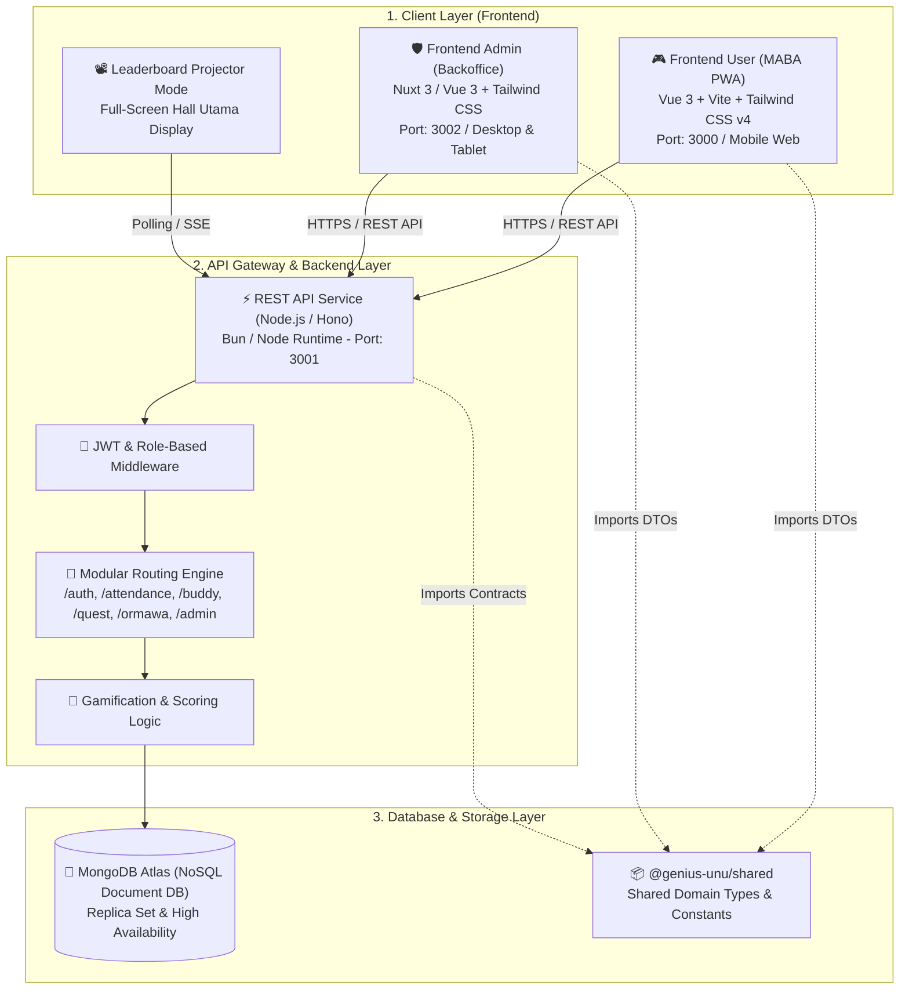
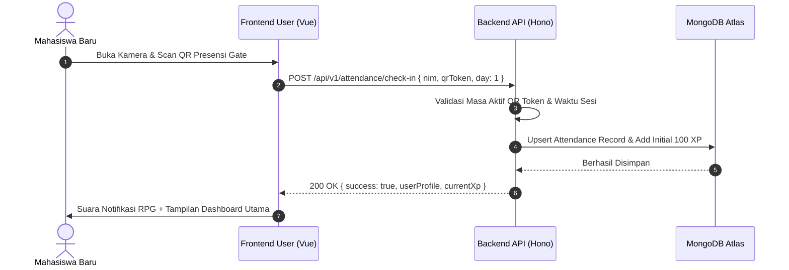
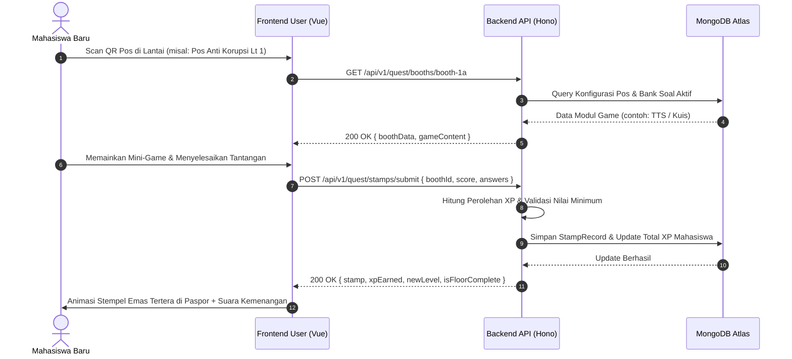
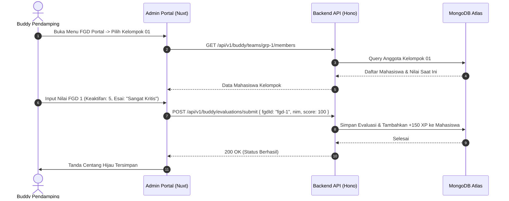

# 🏗️ Arsitektur Sistem & Spesifikasi Tech Stack
### *Platform Gamifikasi & Evaluasi PKKMB GENIUS UNU Yogyakarta 2026*

Dokumen ini mendefinisikan arsitektur teknis, topologi jaringan, pemilihan teknologi (*tech stack*), alur komunikasi data antar-layanan (*data flow*), serta strategi skalabilitas performa tinggi untuk mendukung ribuan mahasiswa baru secara serentak.

---

## 🏛️ Topologi Arsitektur Keseluruhan

Sistem GENIUS UNU 2026 mengadopsi pola **Monorepo (Bun Workspaces)** dengan pemisahan tanggung jawab (*Separation of Concerns*) antara antarmuka pengguna MABA, portal backoffice panitia, backend REST API, dan pustaka tipe bersama (*shared domain library*):

---

## 🧰 Detail Spesifikasi Tech Stack

### 1. Basis Data: NoSQL (MongoDB Atlas)
* **Tipe:** Document-oriented Database (Cloud Managed Replica Set).
* **Alasan Pemilihan:**
  - **Skema Fleksibel untuk Game Modules:** Setiap pos mini-game memiliki format data yang sangat dinamis (TTS memerlukan clue & koordinat matriks, Tebak Kata memerlukan array huruf scramble, Tebak Posisi memerlukan URL gambar, dsb). Skema NoSQL dokumen sangat ideal tanpa perlu migrasi tabel relasional yang kaku.
  - **Performa Tinggi untuk Operasi Write & Read Berulang:** Ribuan request submisi stempel, scan QR presensi, dan voting poin dari Buddy terjadi secara konkuren (*high throughput*).
  - **Aggregation Pipeline Cepat:** Memungkinkan kalkulasi peringkat Leaderboard (Individu, Kelompok, Prodi) secara real-time melalui pipeline `$match`, `$group`, `$sort`, dan `$project`.
  - **TTL & Geolocation Indexes:** Mempermudah implementasi kedaluwarsa QR Code dinamis dan geofencing radius pos jika dibutuhkan.

### 2. Backend API Service: Node.js (Hono / Express)
* **Runtime:** Bun / Node.js LTS.
* **Framework:** **Hono Framework** (alternatif: Express/Fastify).
* **Karakteristik & Fitur Utama:**
  - *Lightweight & Ultra-Fast:* Waktu respon < 15ms untuk query sederhana.
  - *Type-Safe Routing:* Terintegrasi langsung dengan TypeScript dan Zod untuk validasi payload request.
  - *Stateless JWT Authentication:* Menjamin keamanan otentikasi Maba, Buddy, PJ Pos, dan Super Admin.
  - *Driver Database:* MongoDB Official Node.js Driver / Mongoose ODM dengan *Connection Pooling* teroptimasi.

### 3. Frontend Mahasiswa: `@genius-unu/user`
* **Framework:** **Vue 3 (Composition API `<script setup lang="ts">`) + Vite 6**.
* **Styling & Desain:** **Tailwind CSS v4** dengan tema kustom **Retro RPG Stardew Valley Aesthetic** (Pixelated borders, warm wood palettes `#523e2b`, emerald highlights, scroll parchment badges).
* **State Management:** **Pinia (`gameStore`)** untuk menyimpan progres lokal, status offline cache, dan optimasi pemutaran audio.
* **Fitur Kunci:**
  - *Interactive Building Map:* Peta visual interaktif 9 lantai gedung UNU Yogyakarta.
  - *7 Built-in Mini Game Engines:* TTS, Tebak Kata, Kuis Cepat, Benar/Salah, Memory Match, Tebak Posisi, dan Scramble.
  - *HTML5 QR Scanner:* Pemindaian kode QR langsung melalui kamera browser tanpa instalasi aplikasi native (*Zero-Install PWA*).
  - *Audio Synthesizer:* Web Audio API sound effects (8-bit coin sound, stamp sound, victory jingle, level-up fanfare).

### 4. Frontend Admin & Backoffice: `@genius-unu/admin`
* **Framework:** **Nuxt 3 / Vue 3 + Tailwind CSS**.
* **Target Pengguna:** Super Admin, PJ Lantai, Buddy Pendamping, dan Perwakilan Ormawa/UKM.
* **Modul Fungsional:**
  - *Live Dashboard:* Metrik real-time presensi, kelulusan lantai, dan sebaran stempel.
  - *Dynamic Checkpoint (Pos) Builder:* Formulir interaktif untuk menambah/mengedit pos pada 9 lantai.
  - *Question Bank Manager:* CRUD soal dan materi game per modul.
  - *Buddy Evaluation Portal:* Antarmuka khusus Buddy untuk menilai keaktifan FGD 1, 2, dan 6.
  - *Ormawa QR Center:* Generator dan pengekspor kartu cetak QR berbingkai A4 untuk 20+ stand UKM.
  - *Leaderboard Projector Mode:* Tampilan layar penuh LED panggung untuk pengumuman pemenang.

### 5. Shared Monorepo Package: `@genius-unu/shared`
* **Lokasi:** `packages/shared`
* **Fungsi:** Menyediakan *Single Source of Truth* untuk:
  - Definisi TypeScript Interface & Types (User, Admin, Attendance, Floor, Checkpoint, GameModule, Stamp, Leaderboard).
  - Konstanta skema penskoran XP, ambang batas level (*Level Thresholds*), dan daftar pilar materi PKKMB.

---

## 🔄 Alur Data & Siklus Permainan (Game Loop Data Flow)

### 1. Alur Presensi Masuk (Check-In)

### 2. Alur Bermain di Pos Campus Quest (Hari 2)

### 3. Alur Penilaian FGD oleh Buddy

---

## ⚡ Strategi Performa & Skalabilitas (1.000+ Maba Bersamaan)

1. **Stateless Backend:** Server backend tidak menyimpan state sesi di memori, sehingga dapat di-scale secara horizontal (*multi-instance*) di belakang Reverse Proxy (Nginx / Cloudflare).
2. **MongoDB Connection Pooling:** Mengonfigurasi `maxPoolSize: 100` dan `minPoolSize: 10` untuk menangani lonjakan koneksi serentak pada jam-jam puncak (presensi pagi 07:00 dan jam mulai Campus Quest 09:30).
3. **Compound Indexing pada Query Kritis:** Index majemuk pada `{ nim: 1, day: 1 }` untuk presensi dan `{ totalXp: -1, completedFloors: -1 }` untuk sorting leaderboard.
4. **Caching Agregasi Leaderboard:** Leaderboard publik di-*cache* selama 5-10 detik untuk menghindari eksekusi agregasi penuh pada setiap hit request Maba.
5. **Asset Optimization & Offline PWA:** Seluruh aset suara 8-bit, icon pixel, dan CSS di-bundle secara efisien menggunakan Vite dan didukung Service Worker cache.
