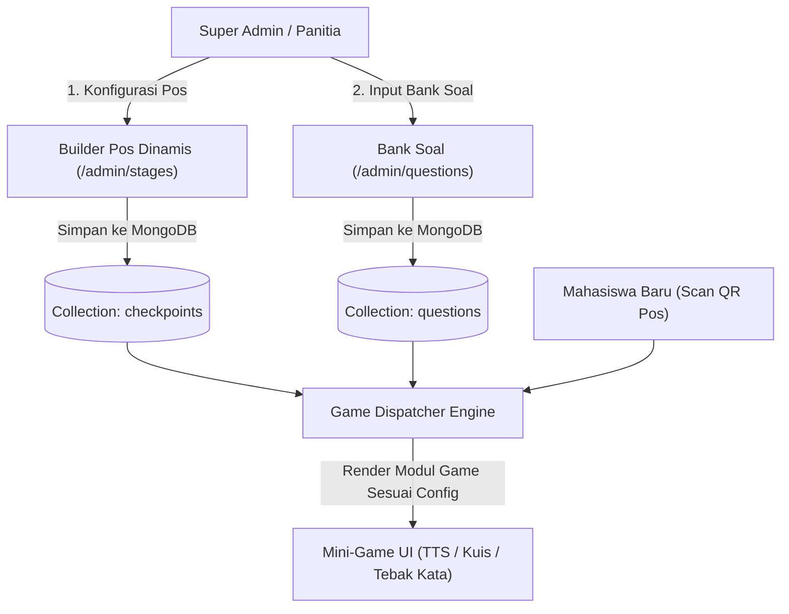

# ⚙️ Spesifikasi Fitur Utama & Logika Gamifikasi
### *Panduan Fungsionalitas Aplikasi GENIUS UNU Yogyakarta 2026*

Dokumen ini menguraikan spesifikasi teknis dan fungsional dari seluruh modul utama aplikasi GENIUS UNU 2026, mulai dari sistem presensi, portal penilaian Buddy, engine pos & soal dinamis, 7 core mini-game, modul UKM/Ormawa Expo, hingga papan peringkat (*Leaderboard*).

---

## 📋 Daftar Modul & Fungsionalitas Utama

```text
1. 📱 Modul Presensi Digital Terverifikasi (Hari 1, 2, 3)
2. 👥 Portal Buddy & Sistem Evaluasi FGD (FGD 1, 2, 6)
3. 🏢 Engine Pos Dinamis & Bank Soal Campus Quest (Hari 2)
4. 🎮 Katalog 7 Core Mini-Game Interaktif (RPG Theme)
5. 🎪 Modul UKM / Ormawa Expo & Bonus XP Accumulator (Hari 3)
6. 🏆 Leaderboard & Mode Proyektor Panggung (Live Hall Utama)
```

---

## 1. 📱 Modul Presensi Digital Terverifikasi

### 🎯 Tujuan
Merekam kehadiran seluruh mahasiswa baru secara teratur, mencegah kecurangan presensi (*anti-titip absen*), dan secara otomatis mengaktifkan profil avatar RPG pada hari pertama.

### ⚙️ Alur & Logika Kerja
1. **Onboarding & Registrasi Hari 1:**
   - Mahasiswa baru mengakses aplikasi web dan memilih menu **"Presensi & Onboarding"**.
   - Kamera memindai QR Presensi Resmi yang ditampilkan panitia di gate masuk.
   - Form pembuatan profil terbuka: Pengisian NIM, Nama Lengkap, Program Studi, Fakultas, Kelompok, dan pemilihan Avatar RPG (Cowok / Cewek).
   - Backend memvalidasi keaslian QR token, menyimpan data ke koleksi `users`, dan mencatat `attendances` Hari 1 dengan status `ON_TIME`.
   - Mahasiswa langsung mendapatkan bonus **+100 XP Presensi Masuk**.
2. **Presensi Hari 2 & Hari 3:**
   - Mahasiswa cukup login dengan NIM dan melakukan scan QR presensi harian.
   - Status presensi terekam secara instan ke MongoDB.
3. **Daily Check-Out & Kuesioner (Hari 1 & 2):**
   - Pada sesi kepulangan (pukul 16:00), mahasiswa mengisi kuesioner harian (*Rating 1-5 & catatan refleksi*).
   - Setelah kuesioner tersimpan, tombol scan QR Pulang aktif.
   - Mahasiswa memindai QR Check-Out dan mendapatkan bonus **+50 XP Check-Out**.

### 🛡️ Fitur Keamanan (Anti-Fraud Guard)
* **Time-Window Token:** QR Code presensi memiliki masa kedaluwarsa dinamis (dapat di-refresh oleh panitia setiap 10-15 menit untuk mencegah tangkapan layar dishare ke luar gedung).
* **Unique Per-Day Constraint:** Database MongoDB memberlakukan indeks unik `{ nim: 1, day: 1 }` sehingga satu mahasiswa tidak dapat presensi ganda di hari yang sama.

---

## 2. 👥 Portal Buddy & Sistem Evaluasi FGD

### 🎯 Tujuan
Memberikan fasilitas bagi para Buddy (Mahasiswa Senior Pendamping) untuk memonitor progres mahasiswa di kelompoknya dan memberikan poin keaktifan pada sesi Diskusi Terarah (FGD).

### ⚙️ Fitur Portal Buddy (`/buddies`)
1. **Daftar Bimbingan Terpusat:** Buddy melihat kartu seluruh anggota kelompok yang ditugaskan kepadanya (lengkap dengan foto avatar, NIM, status presensi, level RPG, dan stempel yang telah diraih).
2. **Form Penilaian FGD (FGD 1, FGD 2, dan FGD 6):**
   - **FGD 1 (Hari 1 - 08:30):** Topik *"Ke UNU apa yang kau cari?"*
   - **FGD 2 (Hari 1 - 10:00):** Topik *"Peran Mahasiswa sebagai Agent of Change"*
   - **FGD 6 (Hari 3 - 11:00):** Topik *"Refleksi Impact & Kontribusi Mahasiswa"*
3. **Rubrik Penilaian Terstandar:**
   - Keaktifan Berpendapat (Skala 1 - 5)
   - Kedalaman Substansi & Visi (Skala 1 - 5)
   - Adab, Etika, dan Sikap Kolaboratif (Skala 1 - 5)
4. **Instant XP Injection:** Ketika Buddy menekan tombol **"Simpan & Beri Nilai"**, sistem mengonversi total skor menjadi XP mahasiswa (+100 s.d. +200 XP per sesi FGD) dan langsung terakumulasi ke papan peringkat.

---

## 3. 🏢 Engine Pos Dinamis & Bank Soal Campus Quest (Hari 2)

### 🎯 Tujuan
Memberikan fleksibilitas penuh kepada Super Admin & Panitia Acara untuk mengatur jumlah pos, lokasi lantai, pilar materi, dan jenis tantangan tanpa perlu melakukan *re-deploy* kode aplikasi.



### ⚙️ Kapabilitas Builder Admin
* **Dukungan Jumlah Pos Fleksibel:** Admin dapat mengaktifkan 8 pos, 12 pos, 18 pos, atau lebih pada lantai 1 s.d. 9 sesuai ketersediaan ruangan kampus.
* **Ganti Tipe Game Sekali Klik:** Pos `B1-A` dapat diubah tipenya dari `TTS` menjadi `Kuis Cepat` atau `Benar/Salah` secara instan dari panel admin.
* **Manajemen Bank Soal:** Admin dapat menambah soal baru, mengatur kunci jawaban, durasi waktu pengerjaan (*timer*), tingkat kesulitan (*Easy / Medium / Hard*), dan poin reward.
* **Cetak QR Otomatis:** Panel `/qr-center` dapat mengekspor seluruh kartu QR Pos ke format siap cetak A4 dengan tata letak bingkai pixel art RPG.

---

## 4. 🎮 Katalog 7 Core Mini-Game Interaktif

Aplikasi dilengkapi dengan 7 mesin permainan (*Game Engines*) berarsitektur mandiri:

| No | Tipe Game | Karakteristik Gameplay | Kasus Penggunaan Ideal |
| :---: | :--- | :--- | :--- |
| **1** | **TTS (Teka-Teki Silang)** | Grid matriks kata interaktif mendatar/menurun dengan kotak input huruf otomatis pindah fokus. | Materi Nilai Aswaja, Istilah Akademik, & Sejarah UNU. |
| **2** | **Tebak Kata (Scramble)** | Mengisi kata kosong dengan memilih dari kumpulan ubin huruf yang teracak (*Letter Tiles*). | Istilah Karakter (Tasamuh, Tawasuth, Tawazun, Amar Maruf). |
| **3** | **Kuis Cepat (Rapid Quiz)** | Soal pilihan ganda dengan hitung mundur 15 detik per soal. | Materi Literasi Digital, Bela Negara, & Finansial. |
| **4** | **Benar / Salah** | Memutuskan validitas pernyataan dalam batas waktu cepat (kartu swipe/tap). | Kode Etik Mahasiswa, Aturan Satgas PPKS, Anti-Narkoba. |
| **5** | **Memory Match** | Membuka dan mencocokkan pasangan kartu konsep/logo yang tertutup. | Pengenalan Fakultas, Tokoh Ulama, & Simbol Kampus. |
| **6** | **Tebak Posisi Kampus** | Mengamati foto ruangan/fasilitas kampus dan menebak lokasi lantai yang benar. | Pengenalan Ruang Perpustakaan, Lab, Selasar, & Rektorat. |
| **7** | **Master Challenge** | Kombinasi teka-teki bertahap pada puncak transformasi (Lantai 9). | Ikrar Upgraded You & Komitmen Kebangsaan. |

### 🏆 Formula Perolehan XP & Stempel
$$\text{XP Diperoleh} = \text{Base XP Pos} + (\text{Skor Game} \times \text{Pengali Akurasi}) + \text{Bonus Kecepatan}$$
* **Threshold Kelulusan Pos:** Minimal perolehan skor **70%**.
* Jika lulus: Maba menerima **Stempel Emas** di paspor digital, suara fanfare kemenangan, dan akumulasi XP.
* Jika belum lulus: Maba diberikan kesempatan mengulang (*retry*) dengan batas cooldown tertentu.

---

## 5. 🎪 Modul UKM / Ormawa Expo & Bonus XP Accumulator (Hari 3)

### 🎯 Tujuan
Mendorong eksplorasi aktif mahasiswa baru pada stand pameran Unit Kegiatan Mahasiswa (UKM) dan Organisasi Mahasiswa (Ormawa) di selasar Lantai 3, 4, dan 5 pada Hari Ke-3.

### ⚙️ Mekanisme Kerja
1. **Penerbitan QR Stand Ormawa:** Setiap Ormawa (contoh: BEM, Paduan Suara, Silat Pagar Nusa, Tari, Robotika, Mapala, KSR PMI, Teater) memiliki kartu QR khusus dengan kode rahasia unik.
2. **Pemindaian oleh MABA:**
   - Mahasiswa mengunjungi stand UKM, berdialog dengan pengurus stand, dan memindai QR stand via aplikasi.
   - Aplikasi memverifikasi scan dan mencatatnya ke koleksi `ormawa_scans`.
3. **Akumulasi Bonus XP:**
   - Setiap scan stand UKM memberikan **+75 XP Bonus**.
   - Membuka **Lencana Pengenal UKM (Ormawa Discovery Badge)** pada profil MABA.
   - Terdapat batas maksimal (*Cap*) pengumpulan bonus XP (misal: maksimal 10 stand / +750 XP) untuk menjaga keseimbangan kompetisi.

---

## 6. 🏆 Leaderboard & Mode Proyektor Panggung

### 🎯 Struktur Level RPG Mahasiswa Baru
Tingkatan level ditentukan berdasarkan jumlah lantai gedung kampus yang telah dituntaskan:

```text
+-------------------+-----------------------+---------------------------------------+
| NAMA LEVEL        | MINIMAL LANTAI SELESAI| DESKRIPSI IDENTITAS KARAKTER          |
+-------------------+-----------------------+---------------------------------------+
| 🌱 New You        | 0 - 1 Lantai          | Mahasiswa baru yang memulai langkah   |
| 🧭 Explorer       | 2 - 3 Lantai          | Penjelajah seluk-beluk kampus         |
| ⚡ Achiever       | 4 - 5 Lantai          | Mahasiswa aktif pembelajar tangguh    |
| 🔥 Almost There   | 6 - 8 Lantai          | Menuju puncak transformasi diri       |
| 👑 Upgraded You   | 9 Lantai Tuntas       | Karakter paripurna UNU Yogyakarta 2026|
+-------------------+-----------------------+---------------------------------------+
```

### 📊 Tipe Papan Peringkat (Leaderboards)
1. **Peringkat Individu (MABA):** Urutan mahasiswa dengan total akumulasi XP tertinggi (Total XP = Presensi + FGD + Stempel Quest + Bonus Ormawa).
2. **Peringkat Kelompok (Regu Binaan):** Rata-rata XP seluruh anggota kelompok untuk memperebutkan gelar *Kelompok Terkompak*.
3. **Statistik Program Studi & Fakultas:** Menampilkan tingkat partisipasi dan persentase penyelesaian misi per prodi.

### 📽️ Fitur Projector Display Mode (`/leaderboard?mode=projector`)
* Desain layar penuh (*fullscreen*) tanpa navigasi samping.
* Efek animasi perpindahan peringkat (*layout spring transitions*).
* Tombol **"Freeze Leaderboard"** bagi panitia untuk mengunci tampilan sebelum pengumuman juara resmi di panggung penutupan (*Closing Ceremony*).
