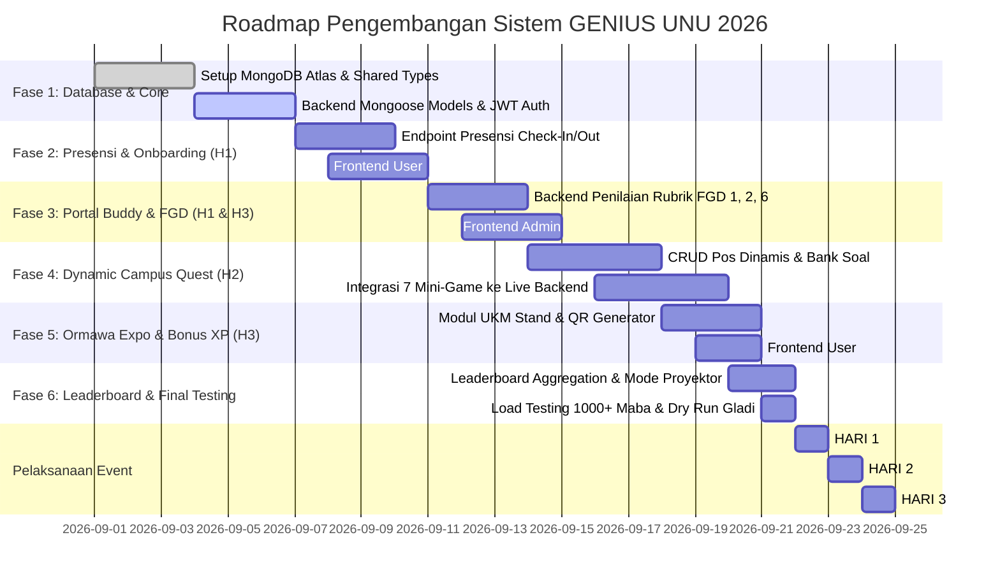

# 🗺️ Roadmap & Rencana Eksekusi Pengembangan
### *Tahapan Implementasi Menuju Produksi PKKMB UNU Yogyakarta 2026*

Dokumen ini menyusun rencana aksi bertahap (*Step-by-Step Implementation Roadmap*) dari kondisi saat ini hingga peluncuran penuh (*Production Launch*) pada hari pelaksanaan acara 22 - 24 September 2026.

---

## 📅 Garis Waktu Pengembangan (Sprint Timeline)

---

## 🎯 Rincian Fase Pengembangan

### 🔹 FASE 1: Fondasi Basis Data NoSQL & Backend Core
**Fokus:** Menghubungkan backend Node.js dengan MongoDB Atlas dan melengkapi pustaka tipe bersama.
1. **Provisioning Database MongoDB Atlas:**
   - Membuat Database Cluster `genius_unu_2026`.
   - Mengonfigurasi *Network Access* (Whitelist IP server & developer).
   - Menyiapkan variabel lingkungan `MONGODB_URI` pada `backend/.env`.
2. **Ekspansi `@genius-unu/shared`:**
   - Menambahkan tipe `Attendance`, `FgDEvaluation`, `Checkpoint`, `Question`, `OrmawaBooth`, dan `SystemSettings`.
3. **Mongoose / Driver Integration:**
   - Membuat folder `backend/src/models/` berisi schema MongoDB untuk setiap koleksi.
   - Mengimplementasikan middleware otentikasi JWT (`backend/src/middlewares/auth.ts`).

---

### 🔹 FASE 2: Sistem Presensi Digital & Onboarding (Kebutuhan Hari 1)
**Fokus:** Menjamin alur kedatangan mahasiswa baru lancar tanpa antrean fisik yang tersendat.
1. **Backend Presensi Service:**
   - Endpoint `POST /api/v1/attendance/check-in` dengan validasi time-window token.
   - Endpoint `POST /api/v1/attendance/check-out` dengan validasi kuesioner refleksi harian.
   - Otomatisasi reward +100 XP check-in dan +50 XP check-out.
2. **Frontend User Onboarding:**
   - Membuat halaman baru `PresensiView.vue` pada `frontend/user`.
   - Integrasi kamera HTML5 QR Scanner untuk scan QR Gate Masuk.
   - Formulir visual pemilihan Avatar RPG (Cowok/Cewek) dan registrasi profil.
3. **Admin Monitoring Presensi:**
   - Widget realtime jumlah mahasiswa yang sudah check-in pagi per program studi.

---

### 🔹 FASE 3: Portal Buddy & Sistem Penilaian FGD (Kebutuhan Hari 1 & 3)
**Fokus:** Fasilitas input nilai keaktifan diskusi kelompok secara cepat oleh Buddy.
1. **Backend Buddy & FGD Service:**
   - Endpoint `GET /api/v1/buddy/teams/:groupId` untuk mengambil daftar anggota kelompok.
   - Endpoint `POST /api/v1/buddy/evaluations/submit` untuk input skor FGD 1, FGD 2, dan FGD 6.
   - Mekanisme kalkulasi XP instan ke profil mahasiswa terkait.
2. **Frontend Admin Buddy Portal:**
   - Menyambungkan halaman `frontend/admin/pages/buddies/[id].vue` dengan endpoint live API.
   - Modal penilaian interaktif dengan rating bintang 1-5 dan input catatan refleksi.

---

### 🔹 FASE 4: Dynamic Campus Quest & Question Bank Builder (Kebutuhan Hari 2)
**Fokus:** Manajemen pos fleksibel di 9 lantai dan integrasi 7 engine mini-game.
1. **Admin Pos & Question Builder:**
   - Menyambungkan `frontend/admin/pages/stages.vue` dan `frontend/admin/pages/questions.vue` ke backend.
   - Fitur tambah/edit/hapus pos misi di lantai 1 s.d. 9.
   - Fitur ganti tipe game pos (TTS, Tebak Kata, Kuis, Benar/Salah, Memory Match, Tebak Posisi).
   - Fitur ekspor kartu QR Pos siap cetak A4 pada `frontend/admin/pages/qr-center.vue`.
2. **Frontend User Game Dispatcher:**
   - Memodifikasi `frontend/user/src/views/PlayView.vue` agar membaca konfigurasi pos dan soal dari backend API (`GET /api/v1/quest/checkpoints/:id`).
   - Mengirim hasil permainan ke `POST /api/v1/quest/stamps/submit`.
   - Update Pinia `gameStore` secara reaktif dari response server.

---

### 🔹 FASE 5: UKM / Ormawa Expo & Bonus XP Accumulator (Kebutuhan Hari 3)
**Fokus:** Eksplorasi stand UKM di selasar lantai 3, 4, 5 dengan akumulasi bonus XP.
1. **Backend Ormawa Service:**
   - Endpoint `GET /api/v1/ormawa/booths` untuk katalog UKM.
   - Endpoint `POST /api/v1/ormawa/scan` untuk klaim bonus +75 XP dan lencana UKM.
2. **Frontend User Ormawa Discovery:**
   - Membuat halaman `OrmawaExpoView.vue` pada `frontend/user`.
   - Daftar katalog UKM terverifikasi dan galeri koleksi lencana UKM yang telah dikunjungi.

---

### 🔹 FASE 6: Realtime Leaderboard & Mode Proyektor Panggung
**Fokus:** Papan peringkat interaktif untuk selebrasi penutupan acara.
1. **Agregasi MongoDB Performa Tinggi:**
   - Pipeline agregasi untuk menghitung peringkat individu, kelompok bimbingan, dan statistik fakultas.
   - Caching in-memory (5-10 detik) untuk menghemat komputasi database.
2. **Layar Proyektor Hall Utama:**
   - Halaman proyektor khusus (`/leaderboard?mode=projector`) beranimasi penuh.
   - Fitur **"Freeze Leaderboard"** untuk mengunci skor sebelum pengumuman juara resmi.

---

### 🔹 FASE 7: Pengujian, Simulasi Beban & Rencana Kontinjensi
1. **Simulasi Beban (Load Testing):**
   - Menjalankan uji beban dengan alat (Autocannon / k6) untuk mensimulasikan 1.000 request presensi dan 500 request game submisi per detik.
2. **SOP Kontinjensi Jaringan Kampus:**
   - Menyediakan backup file CSV presensi jika internet seluler/WiFi kampus mengalami gangguan sementara.
   - Mekanisme *Local Offline Queue* di Pinia: Submisi stempel tersimpan di IndexedDB browser dan dikirim otomatis saat koneksi kembali online (*Sync on Reconnect*).
