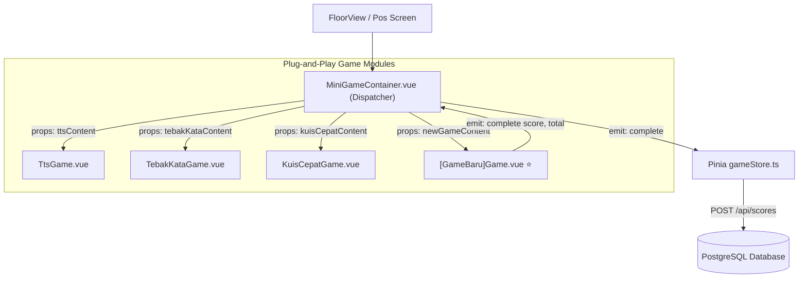

# 🎮 Panduan Standar & Aturan Kontribusi Modul Game Baru (Plug-and-Play)
### *UNU Genius 2026 Developer & Contributor Guide*

Dokumen ini adalah panduan resmi (*Single Source of Truth*) bagi setiap pengembang yang ingin **menambahkan mini-game baru**, memodifikasi mekanik permainan pos, atau memperluas modul pada ekosistem GENIUS UNU 2026.

---

## 🏛️ Filosofi Arsitektur: "Zero-Coupling, Plug-and-Play"

Seluruh mini-game di aplikasi mahasiswa (`frontend/user`) dirancang dengan arsitektur **komponen mandiri (*decoupled*)**. 
Artinya:
* Game baru **tidak boleh** mengakses Pinia `gameStore` secara langsung.
* Game baru **tidak boleh** melakukan fetch HTTP mandiri ke backend secara liar.
* Game baru **hanya menerima data via `props`** dan **mengembalikan hasil via `emit('complete', score, total)`**.
* Seluruh orkestrasi stempel emas, audio kemenangan, penambahan XP, dan pengiriman data ke server ditangani secara terpusat oleh komponen pembungkus: [`MiniGameContainer.vue`](file:///c:/KAIRAV/project/genius_project/frontend/user/src/components/minigames/MiniGameContainer.vue) dan `gameStore.ts`.



---

## 📋 SOP 5 Langkah Menambahkan Modul Game Baru

Jika teman atau Anda ingin membuat mini-game baru (contoh kasus: `ReactionSpeedGame` atau `TimelineDragGame`), ikuti 5 langkah wajib berikut:

---

### Langkah 1: Definisikan Tipe Data di `@genius-unu/shared`
📂 File: `packages/shared/src/types/game.ts`

1. Daftarkan nama tipe game ke `GameType`:
   ```typescript
   export type GameType =
     | 'tts'
     | 'tebak_kata'
     | 'tebak_posisi'
     | 'memory_match'
     | 'kuis_cepat'
     | 'benar_salah'
     | 'timeline_drag'; // <-- Tambahkan tipe baru di sini (snake_case)
   ```

2. Definisikan struktur konten / soal game:
   ```typescript
   export interface TimelineDragItem {
     id: string;
     title: string;
     yearOrOrder: number;
     description: string;
   }

   export interface TimelineDragContent {
     instructions: string;
     items: TimelineDragItem[];
   }
   ```

3. Daftarkan properti opsional ke interface `Booth`:
   ```typescript
   export interface Booth {
     // ... properti lain
     timelineDragContent?: TimelineDragContent; // <-- Properti konten game baru
   }
   ```

---

### Langkah 2: Buat Komponen Vue Game Baru
📂 Lokasi: `frontend/user/src/components/minigames/[NamaGame]Game.vue`  
Contoh: `frontend/user/src/components/minigames/TimelineDragGame.vue`

**Aturan Wajib Kontrak Komponen:**
```vue
<script setup lang="ts">
import { ref } from 'vue';
import type { TimelineDragContent } from '@genius-unu/shared';

// 1. WAJIB: Terima props content dan isCompleted
interface Props {
  content?: TimelineDragContent;
  isCompleted?: boolean;
}

const props = withDefaults(defineProps<Props>(), {
  isCompleted: false,
});

// 2. WAJIB: Emit event 'complete' dengan parameter (score, totalQuestions)
const emit = defineEmits<{
  (e: 'complete', score: number, totalQuestions: number): void;
}>();

// 3. Logika internal game
const userScore = ref(0);
const totalItems = props.content?.items.length || 5;

const finishGame = () => {
  // Hitung skor akhir mahasiswa
  // Ambang kelulusan standar pos adalah 70%
  emit('complete', userScore.value, totalItems);
};
</script>

<template>
  <div class="rpg-box p-4 bg-[#fbf6e9] border-4 border-[#3a2818] rounded-xl font-retro">
    <!-- UI Game Bergaya Retro Stardew Valley -->
    <h3 class="text-lg font-bold text-[#3a2818] mb-3">Tantangan Susun Linimasa</h3>
    
    <!-- Render interaktif game Anda di sini -->
    
    <button 
      @click="finishGame"
      class="pixel-btn bg-[#38761d] text-white px-6 py-2 rounded shadow-md hover:brightness-110 active:translate-y-1"
    >
      Selesai & Kunci Jawaban
    </button>
  </div>
</template>
```

---

### Langkah 3: Daftarkan di Dispatcher Container
📂 File: `frontend/user/src/components/minigames/MiniGameContainer.vue`

1. Import komponen baru:
   ```typescript
   import TimelineDragGame from './TimelineDragGame.vue';
   ```

2. Tambahkan kondisi `v-else-if` di template:
   ```vue
   <TimelineDragGame
     v-else-if="gameType === 'timeline_drag'"
     :content="props.booth.timelineDragContent"
     :isCompleted="props.isCompleted"
     @complete="handleComplete"
   />
   ```

---

### Langkah 4: Tambahkan Contoh Data Soal (Mock & Seed)
1. **Frontend Mock Data:** `frontend/user/src/data/mockData.ts`
   * Tambahkan konfigurasi `timelineDragContent` pada booth pos yang dituju (misal di Lantai 4 Pos A).
2. **Backend Seed (Jika disimpan di DB):** `backend/src/seed.ts`
   * Masukkan payload JSON soal ke pos terkait di tabel `locations` atau `games`.

---

### Langkah 5: Validasi Mutu Monorepo (*Quality Gate*)
Sebelum submit PR atau melakukan commit, pastikan perintah berikut lolos tanpa error:
```bash
# 1. Pastikan tidak ada error TypeScript di semua paket
bun run typecheck

# 2. Pastikan build frontend user dan admin sukses 100%
bun run build
```

---

## 🎨 Panduan Desain & Estetika Visual (UI/UX Guidelines)

Aplikasi GENIUS UNU 2026 mengusung tema **Stardew Valley Retro RPG (Pixel Art 16-bit)**. Komponen game baru **wajib** selaras dengan pedoman desain berikut:

### 1. Palet Warna Resmi
| Peran Warna | Hex Code | Kelas Tailwind / Penggunaan |
| :--- | :--- | :--- |
| **Dark Wood (Border Utama)** | `#3a2818` | `border-[#3a2818]`, `text-[#3a2818]` |
| **Warm Parchment (Background)**| `#fbf6e9` | `bg-[#fbf6e9]` |
| **Wood Plank (Card Header)** | `#8b5a2b` | `bg-[#8b5a2b]`, `text-white` |
| **Moss Green (Tombol Sukses)** | `#38761d` | `bg-[#38761d]`, border `#1e3f10` |
| **Gold / Sun (Aksen Poin/Bintang)**| `#d97706` | `text-[#d97706]`, `bg-[#fef3c7]` |
| **Ruby Red (Kesalahan/Gagal)** | `#b91c1c` | `bg-[#b91c1c]` |

### 2. Efek Sentuhan & Tombol (*Tactile Retro Buttons*)
* Tombol harus memiliki efek tebal (*3D bottom border*):
  ```css
  box-shadow: 0 4px 0 #24190f;
  ```
* Saat ditekan (`:active`):
  ```css
  transform: translateY(3px);
  box-shadow: 0 1px 0 #24190f;
  ```

### 3. Audio Feedback (Sound Effects)
Gunakan modul audio bawaan agar aksi pemain memiliki kepuasan suara (*dopamine hit*):
```typescript
import { useAudio } from '@/composables/useAudio';

const { playClick, playSuccess, playFail } = useAudio();

// Panggil saat aksi terjadi:
playClick();   // Saat memilih kartu / huruf
playSuccess(); // Saat jawaban benar
playFail();    // Saat jawaban salah
```

---

## ⚖️ Aturan Penskoran & Ambang Kelulusan Pos

1. **Threshold Kelulusan:** Minimal nilai **70%** (contoh: 7 dari 10 soal benar).
2. **Kondisi Lulus (Passed):**
   * Mendapatkan **Stempel Emas** di Paspor Digital.
   * Mendapatkan **Base XP Pos (150 XP)** + **Bonus Akurasi (hingga 100 XP)**.
   * Layar memicu efek suara fanfare dan animasi partikel confetti.
3. **Kondisi Belum Lulus (Need Retry):**
   * Mahasiswa diberikan ulasan jawaban yang keliru dan tombol **"Coba Lagi"** (*Retry*).
   * Nilai tertinggi yang akan dicatat oleh sistem.

---

## ⚡ Arsitektur Game 2-Jalur: Client-Evaluated vs Server-Authoritative

Di ekosistem GENIUS UNU 2026, modul game diklasifikasikan ke dalam **2 Jalur Utama**:

```
                              ┌─────────────────────────────────────────┐
                              │           MODUL GAME GENIUS             │
                              └────────────────────┬────────────────────┘
                                                   │
                  ┌────────────────────────────────┴────────────────────────────────┐
                  ▼                                                                 ▼
      [JALUR A: CLIENT-EVALUATED]                                      [JALUR B: SERVER-AUTHORITATIVE]
   * Contoh: TTS, Tebak Kata, Kuis Cepat                           * Contoh: Reaction Speed, Memory Match, AI Drawing
   * Logika & evaluasi di browser Vue                              * Logika, timer anti-cheat, & scoring di Server
   * Selesai ➔ emit('complete', score, total)                      * Komunikasi via REST API + WebSocket (/ws)
   * Mengirim skor via:                                            * Siklus sesi:
     POST /api/scores (Langsung ke Ledger)                           1. POST /api/game-sessions/create
                                                                     2. POST /api/game-sessions/:id/start
                                                                     3. WS /ws (Sync State & Action)
                                                                     4. POST /api/game-sessions/:id/complete
```

---

## 🛠️ Panduan Standar Membuat API Game Khusus & Server-Authoritative (Jalur B)

Jika game yang Anda kembangkan membutuhkan logika server khusus (misal: anti-cheat timer, verifikasi AI, atau sinkronisasi multiplayer turn-based), ikuti aturan berikut agar modul tetap **terisolasi (*zero side-effect*)**:

### Aturan 1: Lokasi & Penamaan File API Backend
Setiap game khusus wajib memiliki modul rutenya sendiri di backend:
* 📂 Lokasi rute khusus: `backend/src/routes/games/[nama-game].ts` (atau langsung extend di `backend/src/engine/index.ts` untuk varian mini-game).
* Contoh:
  * Game AI Drawing ➔ `backend/src/routes/ai.ts` & `backend/src/engine/aiDrawing.ts`
  * Game Incubation Profiling ➔ `backend/src/routes/incubation.ts` & `backend/src/engine/incubation.ts`
  * Game Kecepatan / Kuis Khusus ➔ `backend/src/routes/game-sessions.ts` (menggunakan `GameEngine`)

### Aturan 2: Standar URL Prefix & Schema Validation
* Gunakan prefix yang terisolasi:
  ```typescript
  export const customGameRoutes = new Elysia({
    prefix: "/api/games/[nama-game]",
    detail: {
      tags: ["Game: [Nama Game]"],
    },
  })
    .use(authMiddleware)
    .use(requireUser)
  ```
* Wajib menggunakan validasi skema Elysia `t.Object({...})` untuk setiap request body dan query parameter guna mencegah input injection.

### Aturan 3: Aturan Mutlak Penulisan Nilai ke Database (Ledger-Based Scoring)
> [!CAUTION]
> **DILARANG KERAS** melakukan direct increment pada profil user seperti `UPDATE users SET xp = xp + 100`!

Seluruh penambahan skor dan stempel wajib melalui **Double-Entry Point Ledger (`scoreTransactions`)**:
```typescript
import { db } from "../db";
import { scoreTransactions } from "../db/schema";

await db.insert(scoreTransactions).values({
  participantId: user.userId,
  teamId: targetTeamId,
  amount: Math.round(finalCalculatedScore),
  sourceType: "GAME",                  // atau "BONUS"
  reason: `Penyelesaian Misi Game [Nama Game] (${accuracy}% akurasi)`,
  stageId: stageId || null,
  gameSessionId: sessionId || null,
  createdBy: user.userId,
});
```
**Mengapa aturan ini wajib dipatuhi?**
1. **Audit Trail:** Panitia dapat melacak riwayat perolehan poin setiap mahasiswa per detik.
2. **Freeze Leaderboard Safety:** Sistem dapat memfilter skor mana yang masuk sebelum vs sesudah jam freeze panggung penutupan.
3. **Pencegahan Fraud & Duplikasi:** Mudah dideteksi jika terjadi request spam ganda.

### Aturan 4: Sinkronisasi Real-Time WebSocket (`/ws`)
Setiap kali terjadi perubahan status game atau pencatatan poin baru, backend wajib memicu fungsi siaran terpusat:

```typescript
import { broadcastGameSessionEvent, broadcastLeaderboardUpdate } from "../realtime";

// 1. Siarkan event khusus ke pemain di dalam room sesi game:
broadcastGameSessionEvent(sessionId, "GAME_ACTION", {
  participantId: user.userId,
  action: "CARD_FLIPPED",
  cardIndex: 4,
});

// 2. Siarkan pembaruan peringkat ke proyektor panggung utama dan leaderboard HP:
broadcastLeaderboardUpdate({
  type: "SCORE_SUBMITTED",
  participantId: user.userId,
  teamId: targetTeamId,
  amount: finalCalculatedScore,
});
```

---

## 📑 Template Kode Referensi: Backend Custom Game Route

Berikut adalah template standar siap pakai jika Anda ingin membuat API mandiri untuk game baru:

```typescript
// backend/src/routes/games/reaction-speed.ts
import { Elysia, t } from "elysia";
import { db } from "../../db";
import { scoreTransactions, users } from "../../db/schema";
import { authMiddleware, requireUser } from "../../middleware/auth";
import { broadcastLeaderboardUpdate, broadcastGameSessionEvent } from "../../realtime";

export const reactionSpeedRoutes = new Elysia({
  prefix: "/api/games/reaction-speed",
  detail: {
    tags: ["Game: Reaction Speed"],
  },
})
  .use(authMiddleware)
  .use(requireUser)

  // 1. Inisialisasi Tantangan dari Server (Anti-Bocoran)
  .post("/init", async ({ user }) => {
    const delayMs = Math.floor(Math.random() * 3000) + 2000; // 2 - 5 detik
    const serverToken = crypto.randomUUID();
    
    return {
      success: true,
      data: {
        serverToken,
        delayMs,
        targetRounds: 3,
      },
    };
  })

  // 2. Submisi Hasil & Perhitungan Skor di Server
  .post(
    "/submit",
    async ({ body, user, set }) => {
      const { reactionTimeMs, serverToken } = body;

      // Logika scoring berbobot kecepatan:
      // Di bawah 250ms = 100 XP, 250-400ms = 85 XP, > 400ms = 70 XP
      let awardedXp = 70;
      if (reactionTimeMs < 250) awardedXp = 100;
      else if (reactionTimeMs < 400) awardedXp = 85;

      // Catat ke Database Ledger
      const [tx] = await db.insert(scoreTransactions).values({
        participantId: user!.userId,
        amount: awardedXp,
        sourceType: "GAME",
        reason: `Reaction Speed Challenge (${reactionTimeMs}ms)`,
        createdBy: user!.userId,
      }).returning();

      // Siarkan pembaruan real-time ke panggung & peserta lain
      broadcastLeaderboardUpdate({
        type: "SCORE_SUBMITTED",
        participantId: user!.userId,
        amount: awardedXp,
      });

      return {
        success: true,
        message: `Hebat! Refleks kilat Anda menghasilkan +${awardedXp} XP.`,
        data: { xpEarned: awardedXp, reactionTimeMs },
      };
    },
    {
      body: t.Object({
        serverToken: t.String(),
        reactionTimeMs: t.Number({ minimum: 50, maximum: 5000 }),
      }),
    }
  );
```

### Cara Mendaftarkan Route Baru di Backend:
Cukup buka `backend/src/index.ts` dan tambahkan satu baris:
```typescript
import { reactionSpeedRoutes } from "./routes/games/reaction-speed";

// Di dalam instance app:
app.use(reactionSpeedRoutes);
```

---

## 📋 Checklist Sebelum Menyerahkan Modul Game Baru (*Definition of Done*)

Sebelum fitur game baru dinyatakan siap di-merge ke branch utama:
- [ ] Komponen Frontend Vue menerima `props: { content, isCompleted }` dan meng-emit `@complete(score, total)`.
- [ ] Desain antarmuka mematuhi tema **Stardew Valley Retro RPG** (palet kayu, kertas perkamen, tombol 3D pixel, font retro).
- [ ] Tersedia efek suara interaktif menggunakan `useAudio()`.
- [ ] Penambahan skor tersambung ke `scoreTransactions` (tidak melakukan manipulasi langsung ke tabel user).
- [ ] Jika menggunakan WebSocket, event diberi namespace unik dan memicu `broadcastLeaderboardUpdate()`.
- [ ] Perintah `bun run typecheck` lolos dengan **0 error** di seluruh workspace.
- [ ] Perintah `bun run build` sukses 100%.

