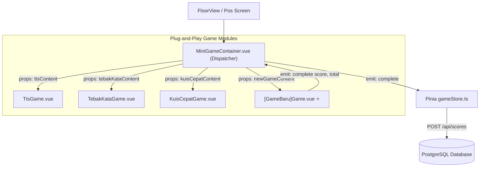

# 🎮 Panduan Standar & Aturan Kontribusi Modul Game Baru (Plug-and-Play)
### *UNU Genius 2026 Developer & Contributor Guide*

Dokumen ini adalah panduan resmi (*Single Source of Truth*) bagi setiap pengembang yang ingin **menambahkan mini-game baru**, memodifikasi mekanik permainan pos, atau memperluas modul pada ekosistem GENIUS UNU 2026.

---

## 🏛️ Filosofi Arsitektur: "Zero-Coupling, Plug-and-Play"

Seluruh mini-game di aplikasi mahasiswa (`frontend/user`) dirancang dengan arsitektur **komponen mandiri (*decoupled*)**. 
Artinya:
* Game baru **tidak boleh** mengakses Pinia `gameStore` secara langsung.
* Game baru **tidak boleh** melakukan fetch HTTP mandiri ke backend secara liar.
* Game baru **hanya menerima data via `props`** dan **mengembalikan hasil via `emit('complete', score, total)`**.
* Seluruh orkestrasi stempel emas, audio kemenangan, penambahan XP, dan pengiriman data ke server ditangani secara terpusat oleh komponen pembungkus: [`MiniGameContainer.vue`](file:///c:/KAIRAV/project/genius_project/frontend/user/src/components/minigames/MiniGameContainer.vue) dan `gameStore.ts`.



---

## 📋 SOP 5 Langkah Menambahkan Modul Game Baru

Jika teman atau Anda ingin membuat mini-game baru (contoh kasus: `ReactionSpeedGame` atau `TimelineDragGame`), ikuti 5 langkah wajib berikut:

---

### Langkah 1: Definisikan Tipe Data di `@genius-unu/shared`
📂 File: `packages/shared/src/types/game.ts`

1. Daftarkan nama tipe game ke `GameType`:
   ```typescript
   export type GameType =
     | 'tts'
     | 'tebak_kata'
     | 'tebak_posisi'
     | 'memory_match'
     | 'kuis_cepat'
     | 'benar_salah'
     | 'timeline_drag'; // <-- Tambahkan tipe baru di sini (snake_case)
   ```

2. Definisikan struktur konten / soal game:
   ```typescript
   export interface TimelineDragItem {
     id: string;
     title: string;
     yearOrOrder: number;
     description: string;
   }

   export interface TimelineDragContent {
     instructions: string;
     items: TimelineDragItem[];
   }
   ```

3. Daftarkan properti opsional ke interface `Booth`:
   ```typescript
   export interface Booth {
     // ... properti lain
     timelineDragContent?: TimelineDragContent; // <-- Properti konten game baru
   }
   ```

---

### Langkah 2: Buat Komponen Vue Game Baru
📂 Lokasi: `frontend/user/src/components/minigames/[NamaGame]Game.vue`  
Contoh: `frontend/user/src/components/minigames/TimelineDragGame.vue`

**Aturan Wajib Kontrak Komponen:**
```vue
<script setup lang="ts">
import { ref } from 'vue';
import type { TimelineDragContent } from '@genius-unu/shared';

// 1. WAJIB: Terima props content dan isCompleted
interface Props {
  content?: TimelineDragContent;
  isCompleted?: boolean;
}

const props = withDefaults(defineProps<Props>(), {
  isCompleted: false,
});

// 2. WAJIB: Emit event 'complete' dengan parameter (score, totalQuestions)
const emit = defineEmits<{
  (e: 'complete', score: number, totalQuestions: number): void;
}>();

// 3. Logika internal game
const userScore = ref(0);
const totalItems = props.content?.items.length || 5;

const finishGame = () => {
  // Hitung skor akhir mahasiswa
  // Ambang kelulusan standar pos adalah 70%
  emit('complete', userScore.value, totalItems);
};
</script>

<template>
  <div class="rpg-box p-4 bg-[#fbf6e9] border-4 border-[#3a2818] rounded-xl font-retro">
    <!-- UI Game Bergaya Retro Stardew Valley -->
    <h3 class="text-lg font-bold text-[#3a2818] mb-3">Tantangan Susun Linimasa</h3>
    
    <!-- Render interaktif game Anda di sini -->
    
    <button 
      @click="finishGame"
      class="pixel-btn bg-[#38761d] text-white px-6 py-2 rounded shadow-md hover:brightness-110 active:translate-y-1"
    >
      Selesai & Kunci Jawaban
    </button>
  </div>
</template>
```

---

### Langkah 3: Daftarkan di Dispatcher Container
📂 File: `frontend/user/src/components/minigames/MiniGameContainer.vue`

1. Import komponen baru:
   ```typescript
   import TimelineDragGame from './TimelineDragGame.vue';
   ```

2. Tambahkan kondisi `v-else-if` di template:
   ```vue
   <TimelineDragGame
     v-else-if="gameType === 'timeline_drag'"
     :content="props.booth.timelineDragContent"
     :isCompleted="props.isCompleted"
     @complete="handleComplete"
   />
   ```

---

### Langkah 4: Tambahkan Contoh Data Soal (Mock & Seed)
1. **Frontend Mock Data:** `frontend/user/src/data/mockData.ts`
   * Tambahkan konfigurasi `timelineDragContent` pada booth pos yang dituju (misal di Lantai 4 Pos A).
2. **Backend Seed (Jika disimpan di DB):** `backend/src/seed.ts`
   * Masukkan payload JSON soal ke pos terkait di tabel `locations` atau `games`.

---

### Langkah 5: Validasi Mutu Monorepo (*Quality Gate*)
Sebelum submit PR atau melakukan commit, pastikan perintah berikut lolos tanpa error:
```bash
# 1. Pastikan tidak ada error TypeScript di semua paket
bun run typecheck

# 2. Pastikan build frontend user dan admin sukses 100%
bun run build
```

---

## 🎨 Panduan Desain & Estetika Visual (UI/UX Guidelines)

Aplikasi GENIUS UNU 2026 mengusung tema **Stardew Valley Retro RPG (Pixel Art 16-bit)**. Komponen game baru **wajib** selaras dengan pedoman desain berikut:

### 1. Palet Warna Resmi
| Peran Warna | Hex Code | Kelas Tailwind / Penggunaan |
| :--- | :--- | :--- |
| **Dark Wood (Border Utama)** | `#3a2818` | `border-[#3a2818]`, `text-[#3a2818]` |
| **Warm Parchment (Background)**| `#fbf6e9` | `bg-[#fbf6e9]` |
| **Wood Plank (Card Header)** | `#8b5a2b` | `bg-[#8b5a2b]`, `text-white` |
| **Moss Green (Tombol Sukses)** | `#38761d` | `bg-[#38761d]`, border `#1e3f10` |
| **Gold / Sun (Aksen Poin/Bintang)**| `#d97706` | `text-[#d97706]`, `bg-[#fef3c7]` |
| **Ruby Red (Kesalahan/Gagal)** | `#b91c1c` | `bg-[#b91c1c]` |

### 2. Efek Sentuhan & Tombol (*Tactile Retro Buttons*)
* Tombol harus memiliki efek tebal (*3D bottom border*):
  ```css
  box-shadow: 0 4px 0 #24190f;
  ```
* Saat ditekan (`:active`):
  ```css
  transform: translateY(3px);
  box-shadow: 0 1px 0 #24190f;
  ```

### 3. Audio Feedback (Sound Effects)
Gunakan modul audio bawaan agar aksi pemain memiliki kepuasan suara (*dopamine hit*):
```typescript
import { useAudio } from '@/composables/useAudio';

const { playClick, playSuccess, playFail } = useAudio();

// Panggil saat aksi terjadi:
playClick();   // Saat memilih kartu / huruf
playSuccess(); // Saat jawaban benar
playFail();    // Saat jawaban salah
```

---

## ⚖️ Aturan Penskoran & Ambang Kelulusan Pos

1. **Threshold Kelulusan:** Minimal nilai **70%** (contoh: 7 dari 10 soal benar).
2. **Kondisi Lulus (Passed):**
   * Mendapatkan **Stempel Emas** di Paspor Digital.
   * Mendapatkan **Base XP Pos (150 XP)** + **Bonus Akurasi (hingga 100 XP)**.
   * Layar memicu efek suara fanfare dan animasi partikel confetti.
3. **Kondisi Belum Lulus (Need Retry):**
   * Mahasiswa diberikan ulasan jawaban yang keliru dan tombol **"Coba Lagi"** (*Retry*).
   * Nilai tertinggi yang akan dicatat oleh sistem.
