# 🏛️ GENIUS UNU 2026 — Dokumen Arsitektur & Penyelarasan Alur Frontend 3 Hari

> **Dokumen Resmi Penyelarasan Tim Frontend & Event Flow PKKMB UNU Yogyakarta 2026**  
> *Fokus: Implementasi Fungsional Frontend Independen (Offline-First / Dummy Reactive Store) Menjelang Integrasi API Backend.*

---

## 📋 1. Eksekutif Ringkasan & Prinsip Desain

Aplikasi **GENIUS UNU 2026** memiliki tujuan utama mendampingi mahasiswa baru (MABA) selama **3 hari rangkaian acara (22 - 24 September 2026)**. Agar sistem dapat diuji, didemokan, dan dioperasikan secara fleksibel tanpa hambatan infrastruktur (seperti belum tersedianya Docker di komputer lokal), **seluruh lapisan frontend dirancang mandiri (*self-contained*) dengan reaktivitas state penuh berbasis `localStorage` + mock client**, namun strukturnya 100% identik dengan kontrak REST API yang disiapkan oleh tim backend (`kairav_dev`).

### 3 Pilar Peran Pengguna (*Roles*):
1. **User - MABA (Peserta):** Mobile web RPG di smartphone peserta. Digunakan untuk presensi gerbang, eksplorasi 9 lantai kampus, bermain 7 modul mini-game pos, berburu lencana UKM/Ormawa di Hari 3, dan mengisi refleksi harian.
2. **User - BUDDY (Pendamping Kelompok):** Portal pendamping mahasiswa untuk memantau anggota kelompoknya, memvalidasi kehadiran, serta menginput **Rubrik Penilaian FGD 3 Pilar** (Keaktifan, Kedalaman Visi, Adab/Etika).
3. **ADMIN & PANITIA (Command Center):** Dashboard terpusat untuk memantau trafik 9 lantai, mencetak kartu QR A4 resmi (Pos, Gate Presensi, Stand Ormawa), mengaktifkan **Freeze Leaderboard**, serta menayangkan **Mode Proyektor Panggung Layar Akbar**.

---

## 🗓️ 2. Pemetaan Alur Lapangan 3 Hari (*The Real 3-Day Event Flow*)

```mermaid
graph TD
    subgraph HARI_1["HARI 1: IDENTITY & REFLECTION (22 Sept)"]
        H1_A["07:00 Gate Presensi Masuk (Scan QR +100 XP)"] --> H1_B["Pilih Kelas Karakter & Avatar RPG"]
        H1_B --> H1_C["Opening Ceremony & Hall Utama"]
        H1_C --> H1_D["FGD 1 (Niat) & FGD 2 (Bela Negara)"]
        H1_D --> H1_E["Buddy Input Rubrik Penilaian 3 Pilar (+40 s/d +200 XP)"]
        H1_E --> H1_F["16:00 Kuesioner Refleksi (+25 XP) & Scan Pulang (+50 XP)"]
    end

    subgraph HARI_2["HARI 2: 9-FLOOR CAMPUS QUEST (23 Sept)"]
        H2_A["07:00 Presensi Masuk H2"] --> H2_B["Panduan Rute Kelompok (Crowd Control)"]
        H2_B --> H2_C["Campus Quest Sesi 1 (Lt 1-4: Pos Karakter & Aswaja)"]
        H2_C --> H2_D["Scan QR Pos Fisik & Selesaikan Mini-Game (TTS, Scramble, Kuis)"]
        H2_D --> H2_E["Campus Quest Sesi 2 (Lt 5-9: Riset, AI, PPKS, Puncak)"]
        H2_E --> H2_F["Koleksi 18 Stempel Emas & Evolusi Level RPG (New You ➔ Upgraded You)"]
        H2_F --> H2_G["16:00 Presensi Pulang & Refleksi H2"]
    end

    subgraph HARI_3["HARI 3: ORMAWA EXPO & GRAND FINALE (24 Sept)"]
        H3_A["07:00 Presensi Masuk H3"] --> H3_B["UNU Berdampak & FGD 6 (Impact Mahasiswa)"]
        H3_B --> H3_C["12:30 UKM/Ormawa Expo (Selasar Lt 3, 4, 5)"]
        H3_C --> H3_D["Berburu Stand UKM (Scan QR +75 XP / Capping 10 Stand)"]
        H3_D --> H3_E["15:00 Panitia Tekan FREEZE LEADERBOARD"]
        H3_E --> H3_F["15:30 Mode Proyektor Layar Panggung Hall Utama (Awarding)"]
    end
```



---

## 🔍 3. Audit Gap Analisis Frontend (Current State vs Target Alur)

| Komponen & Fitur Lapangan | Target Pengguna | Status Saat Ini | Rencana Tindakan Frontend |
| :--- | :--- | :---: | :--- |
| **Presensi Digital Anti-Titip Absen** | MABA & Buddy | ❌ Belum ada UI | Buat `AttendanceView.vue` di `frontend/user` lengkap dengan tabs Hari 1-3, validasi jam (07:00-07:30 = On-Time, >07:30 = Late), reward +100 XP masuk, dan +50 XP pulang. |
| **Kuesioner Refleksi Harian** | MABA | ❌ Belum ada UI | Tambahkan form refleksi 3 rating bintang (Fasilitas, Materi, Buddy) + esai singkat (+25 XP) sebelum tombol scan pulang diaktifkan. |
| **Kamera Scanner QR Universal PWA** | MABA | ⚠️ Scanner terbatas di booth | Buat modal `QrScannerModal.vue` reusable dengan kamera browser HTML5 (`navigator.mediaDevices`), radar visual pixel-art, bunyi beep, serta tombol fallback input manual. |
| **Ormawa Expo Scanner & XP Capping** | MABA | ❌ Belum ada UI | Buat `OrmawaExpoView.vue` di `frontend/user` berisi katalog stan UKM selasar Lt 3-5, scanner QR stan, animasi unlock badge, dan counter limit kuota 10 stan (+750 XP). |
| **Onboarding & Profil Karakter RPG** | MABA | ⚠️ Statis di memory | Buat dialog/halaman Login cepat dengan akun demo (`peserta_1` s/d `peserta_5`), pemilihan kelas karakter (Cyber Knight, Tech Mage, dll), dan persistensi ke `localStorage`. |
| **Crowd Control Rute Kelompok** | MABA & Admin | ❌ Belum ditampilkan | Tampilkan banner penunjuk rute awal di beranda MABA: *"Rute Regu Anda (Kelompok 03): Mulai dari Lantai 3 (Pos B3-A)"*. Di Admin `/teams` sediakan visualisasi sebaran rute. |
| **Rubrik Evaluasi FGD Buddy 3 Pilar** | Buddy | ❌ Belum ada di UI | Buat modul evaluasi FGD di `/buddies/[id]` atau `/buddies/evaluation`: Input nilai Keaktifan (1-5), Kedalaman Visi (1-5), Adab/Etika (1-5), catatan apresiasi, dan hitung instan +40 s/d +200 XP. |
| **Pusat Cetak Kartu QR Center A4** | Admin & Panitia | ⚠️ Baru 18 pos saja | Perluas `/qr-center` agar mencakup: 1. Kartu Pos Lantai (18 pos), 2. Kartu Gerbang Presensi Masuk/Pulang H1-H3, 3. Kartu Stan UKM Expo (20+ booth). Sempurnakan CSS `@media print` A4. |
| **Freeze Leaderboard & Mode Proyektor** | Panitia & MABA | ⚠️ Freeze darurat saja | Tambahkan toggle Freeze Leaderboard yang mengunci skor publik dengan banner info di HP MABA, serta tambahkan **Theater Mode** fullscreen untuk proyektor penutupan. |

---

## 🛠️ 4. Arsitektur Dummy Store & Offline-First State (Pinia + LocalStorage)

Agar aplikasi dapat berjalan mulus tanpa server backend/docker, kita menerapkan arsitektur *Hybrid State*:
1. **Primary Layer:** Pinia Store yang otomatis me-load dan men-save ke `localStorage` (Key: `genius_user_state_v1` dan `genius_admin_mock_db`).
2. **Contract-Ready API Wrapper:** Setiap aksi di store memanggil fungsi adaptor yang secara asinkron menirukan format payload backend (`ApiResponse<T>`). Ketika backend live dinyalakan nantinya, cukup ubah satu baris konfigurasi toggle `USE_LIVE_API: true`.

### Struktur Model Data Penyimpanan Lokal Baru:
```typescript
interface ParticipantProgress {
  // Profil & Karakter
  nim: string;
  name: string;
  prodi: string;
  faculty: string;
  characterClass: string;
  avatar: string;
  totalXp: number;
  level: 'New You' | 'Explorer' | 'Achiever' | 'Almost There' | 'Upgraded You';
  teamId: string;
  teamRoute: string; // e.g. "Mulai dari Lantai 3"

  // Progres Pos 9 Lantai
  completedBooths: string[]; // ['booth-1a', 'booth-1b', ...]
  stamps: Record<string, StampRecord>;

  // Presensi 3 Hari
  attendance: {
    day1: { checkIn: string | null; checkOut: string | null; reflection: any | null; xpAwarded: number };
    day2: { checkIn: string | null; checkOut: string | null; reflection: any | null; xpAwarded: number };
    day3: { checkIn: string | null; checkOut: string | null; reflection: any | null; xpAwarded: number };
  };

  // Ormawa Expo Hari 3
  ormawa: {
    scannedBooths: string[]; // ['ORMAWA-SILAT', 'ORMAWA-ROBOTIK']
    totalXp: number; // Max 750 XP
    badges: Array<{ code: string; name: string; icon: string; color: string; unlockedAt: string }>;
  };
}
```

---

## 🎯 5. Rencana Aksi Eksekusi Frontend Terstruktur

### 🚀 FASE 1: Frontend User — Presensi, Kamera PWA, & Ormawa Expo
1. **Komponen Kamera Scanner (`frontend/user/src/components/common/QrScannerModal.vue`)**:
   - Komponen modal universal untuk memindai QR code dari kamera HP browser.
   - Dilengkapi animasi scanline laser hijau, deteksi kode QR otomatis, dan input manual cadangan.
2. **Halaman Presensi & Refleksi Harian (`frontend/user/src/views/AttendanceView.vue`)**:
   - Navigasi tab Hari 1, Hari 2, Hari 3.
   - Status Card Check-in Masuk (+100 XP).
   - Form Kuesioner Refleksi 3 Bintang + Esai Singkat (+25 XP).
   - Tombol Check-out Kepulangan (+50 XP).
3. **Halaman Penjelajah Ormawa Expo Hari 3 (`frontend/user/src/views/OrmawaExpoView.vue`)**:
   - Katalog stan pameran UKM selasar lantai 3-5 dengan tab kategori.
   - Tombol Scan QR Booth -> trigger reward badge +75 XP.
   - Counter kuota pemburu UKM (Limit: 10 booth / +750 XP).
4. **Penyempurnaan Store & Navigasi**:
   - Daftarkan rute `/presensi` dan `/ormawa` di `router/index.ts`.
   - Tambahkan banner Rute Regu di `HomeView.vue`.
   - Update `PasporView.vue` untuk menampilkan tab Koleksi Lencana Ormawa.

### 🚀 FASE 2: Frontend Admin — Rubrik Buddy, Cetak QR A4, & Mode Proyektor
1. **Form Evaluasi FGD Buddy 3 Pilar (`frontend/admin/pages/buddies/[id].vue`)**:
   - Tab penilaian FGD 1 (Intention), FGD 2 (Bela Negara), FGD 6 (Impact).
   - Rubrik interaktif: Keaktifan (1-5), Kedalaman (1-5), Adab (1-5) dengan kalkulasi otomatis XP (+40 s/d +200 XP).
   - Simpan riwayat evaluasi ke local state Buddy.
2. **Pusat Cetak QR Center A4 Multi-Kategori (`frontend/admin/pages/qr-center.vue`)**:
   - Tambahkan filter tab: **Pos Lantai (18)**, **Gerbang Presensi (H1-H3 Masuk/Pulang)**, dan **Stan Ormawa Expo (20+)**.
   - Sempurnakan CSS cetak `@media print` layout A4 rapi tanpa header dashboard.
3. **Kendali Freeze Leaderboard & Layar Akbar Panggung**:
   - Tambahkan saklar toggle "Freeze Leaderboard" di header atau settings admin.
   - Buat mode fullscreen proyektor di `/leaderboard?mode=projector` dengan tampilan megah podium Top 3 dan ticker klasemen.

---

Dokumen ini menjadi panduan kerja terpadu agar pengerjaan modul frontend berlangsung tertib, terarah, dan dapat langsung dinikmati pengguna secara visual.
