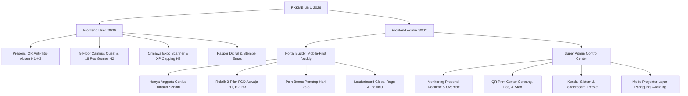

# 📜 Panduan Implementasi Frontend Lengkap — GENIUS UNU 2026

Dokumen ini merupakan panduan teknis dan operasional untuk seluruh tim (Frontend, Backend oleh `kairav_dev`, dan Tim Acara PKKMB UNU Yogyakarta 2026). Seluruh fitur telah diimplementasikan secara **100% fungsional, interaktif, dan offline-first (Zero-Docker / `localStorage`)** dengan tema visual **Stardew Valley Retro 2D Pixel RPG**.

---

## 🏛️ Arsitektur Tiga Persona (User, Buddy, & Admin)



---

## 1. 📱 Frontend Mahasiswa Baru (`frontend/user` — Port 3000)

### A. Presensi Digital Anti-Titip Absen (`/presensi`)
- **Alur 3 Gerbang Harian:**
  - **Pagi (06.30 - 07.30 WIB):** Scan QR Gerbang Masuk (`UNU-PRESENSI-H[1-3]-GATE-2026`) &rarr; **+100 XP**. Otomatis mencatat status `ON_TIME` atau `LATE`.
  - **Sore (15.00 - 15.30 WIB):** Pengisian Kuesioner Refleksi 3 Bintang (Fasilitas, Materi, Peran Buddy) + Esai Refleksi Aswaja &rarr; **+25 XP**.
  - **Pulang (16.00 - 17.00 WIB):** Scan QR Gerbang Pulang (`UNU-PRESENSI-H[1-3]-CHECKOUT-2026`) &rarr; **+50 XP**. Kunci presensi hari itu terkunci rapi.
- **PWA Camera Scanner (`QrScannerModal.vue`):**
  - Menggunakan API `navigator.mediaDevices.getUserMedia` dan `BarcodeDetector` (jika didukung).
  - Tampilan visual radar laser pixel hijau.
  - Dilengkapi tombol preset demo instan jika kamera tidak memiliki izin atau saat simulasi panitia.

### B. Ormawa Expo Scanner & XP Capping (Hari ke-3)
> [!IMPORTANT]
> **CATATAN KRUSIAL:** 
> **Pihak Ormawa/UKM TIDAK memiliki akses aplikasi, TIDAK memiliki akun login, dan TIDAK memiliki antarmuka (UI).** 
> Panitia Ormawa murni menjaga stan fisik mereka di selasar kampus. Setiap meja stan UKM hanya memajang **lembar kertas/akrilik QR Code fisik unik** yang di-generate dan dicetak oleh Admin dari menu **QR Print Center**.

- **Alur Lapangan:**
  1. Panitia Admin mencetak lembar QR resmi UKM dari Admin Dashboard (`/qr-center` &rarr; tab *Stand Ormawa Expo*).
  2. Lembar QR fisik ditaruh di masing-masing meja stan UKM di Selasar Lantai 3, 4, dan 5.
  3. Mahasiswa Baru (Maba) mendatangi stan fisik secara langsung.
  4. Maba membuka **Paspor Digital** di smartphone mereka (`/paspor`) dan menekan tombol **"PINDAI QR MEJA STAN"**.
  5. Kamera HP memindai kertas QR fisik di meja stan &rarr; stempel lencana UKM otomatis terkoleksi di buku paspor digital maba.
- **Aturan XP Capping:**
  - Tiap scan stan fisik memberikan **+75 XP**.
  - Diberlakukan **XP Capping maksimal 10 stan (+750 XP)** untuk mencegah eksploitasi poin.
  - Jika maba telah mencapai 10 stan, scan stan fisik ke-11 dan seterusnya tetap berhasil mengoleksi stempel lencana di paspor, tetapi perolehan poin bertuliskan `+0 XP (Batas XP Capping 10 Stan Tercapai)`.

---

## 2. 🤝 Portal Khusus Buddy (`frontend/admin` — Port 3002)

Buddy memiliki tampilan yang **berbeda total dari Super Admin**:
- **Mobile-First Layout:** Terbatas pada container ramping `max-w-xl mx-auto` tanpa sidebar desktop yang membingungkan.
- **Bilah Navigasi Bawah (Dock 4 Tab):**
  1. `Anggota` (`/buddy`):
     - Hanya menampilkan daftar anggota kelompok binaan Buddy (misal *Team Garuda Sakti - Kelompok 01*).
     - Menampilkan rute panduan crowd control (Lantai awal mulai quest).
     - Menampilkan status presensi pagi, progres stempel 9 lantai, dan tombol verifikasi hadir manual.
  2. `Nilai FGD` (`/buddy/fgd`):
     - Penilaian FGD 1 & 2 (Hari 1) serta FGD 6 (Hari 3).
     - Rubrik 3 Pilar Aswaja: **Keaktifan Diskusi (1-5)**, **Kedalaman Gagasan (1-5)**, dan **Adab & Tawadhu' (1-5)**.
     - Terhitung otomatis menjadi skor transparan (+40 s/d +200 XP).
  3. `Bonus H3` (`/buddy/bonus`):
     - Poin penutup di sesi akhir Hari ke-3:
       - **Bonus Kekompakan Regu:** +50, +100, atau +150 XP per anggota dengan checklist kriteria (kehadiran, yel-yel, kepatuhan rute).
       - **Duta Kelompok Teraktif (Star Maba):** Memilih 1 mahasiswa paling inspiratif untuk mendapat gelar bintang dan bonus +150 XP.
       - **Pesan Kelulusan Buddy:** Catatan apresiasi yang tersimpan di riwayat kelulusan mahasiswa.
  4. `Leaderboard` (`/buddy/leaderboard`):
     - Tab Klasemen Regu (kelompok bimbingan di-highlight dengan border emas).
     - Tab Klasemen Individu Se-Kampus (anggota sendiri diberi badge khusus).

---

## 3. 👑 Super Admin & Master Control (`frontend/admin` — Port 3002)

- **Master Presensi (`/attendance`):**
  - Tab Hari 1, 2, dan 3.
  - Filter kelompok dan pencarian nama/NIM.
  - Pembaca esai refleksi harian mahasiswa.
  - Tombol override manual check-in untuk panitia gerbang.
  - Export CSV data kehadiran resmi universitas.
- **QR Print Center (`/qr-center`):**
  - Kartu QR A4 siap cetak untuk:
    - Gerbang Presensi Pagi & Kepulangan H1-H3.
    - 18 Pos Quest 9 Lantai.
    - 12 Meja Stan Ormawa Expo Selasar Lantai 3-5.
- **Leaderboard Control & Freeze Mode (`/leaderboard`):**
  - **Freeze Button:** Membekukan nilai live mahasiswa saat closing Hari ke-3 agar pengumuman juara umum di panggung tetap menjadi kejutan.
  - **Audit Ledger:** Rekam jejak seluruh penambahan poin manual/sistem.
- **Mode Proyektor Layar Panggung (`/projector`):**
  - Layar penuh 16:9 tanpa chrome admin (cocok untuk output HDMI panggung utama).
  - Tampilan Podium 3D/2D Juara 1, 2, 3 dengan efek cahaya emas.
  - **Ceremony Reveal Mode:** Membuka Juara 3 (Perunggu) &rarr; Juara 2 (Perak) &rarr; Juara 1 (Emas) dengan animasi dramatis.

---

## 💾 Daftar Kunci State LocalStorage (Untuk Handover ke `kairav_dev`)

Bagi tim backend (`kairav_dev`), seluruh struktur data yang tersimpan di browser telah distandarkan:

| Kunci LocalStorage | Penjelasan Data | Target Endpoint Backend (Saat Tersedia) |
|---|---|---|
| `genius_unu_user_storage_v1` | State peserta maba, completed booths, stempel, attendance H1-H3, dan ormawa terdaftar | `GET /api/participants/me`, `POST /api/attendance/check-in`, `POST /api/attendance/checkout` |
| `genius_ormawa_visited` | Array ID stan UKM yang dikunjungi maba | `POST /api/ormawa/scan` |
| `genius_buddy_fgd_scores` | Map nilai evaluasi FGD per peserta oleh Buddy | `POST /api/fgd/evaluate` |
| `genius_buddy_day3_bonus` | Nilai bonus kekompakan regu & duta maba dari Buddy | `POST /api/scores/bonus-team` |
| `genius_leaderboard_frozen` | Boolean status freeze klasemen publik (`true` / `false`) | `POST /api/settings/freeze` |

---

## 🚀 Cara Menjalankan & Menguji Aplikasi

```bash
# Terminal 1: Frontend User (Mahasiswa Baru) -> Port 3000
bun run dev:user

# Terminal 2: Frontend Admin & Portal Buddy -> Port 3002
bun run dev:admin

# Build Verifikasi (Pastikan 0 Error)
bun run build
```

### Tips Pengujian Cepat:
1. **Beralih Peran Admin vs Buddy:** Buka `http://localhost:3002`, klik tombol toggle peran di pojok kanan atas untuk beralih secara instan antara mode **Superadmin** (Desktop) dan **Buddy** (Mobile-first).
2. **Uji Presensi QR:** Buka `http://localhost:3000/presensi`, pilih preset kode gerbang masuk/pulang demo.
3. **Uji Ormawa Expo:** Buka `http://localhost:3000/ormawa`, lakukan simulasi scan stan hingga 10 stan untuk melihat efek XP Capping.
4. **Uji Layar Panggung:** Buka `http://localhost:3002/projector`, tekan tombol "REVEAL DRAMATIS" untuk simulasi pengumuman juara di panggung utama.
