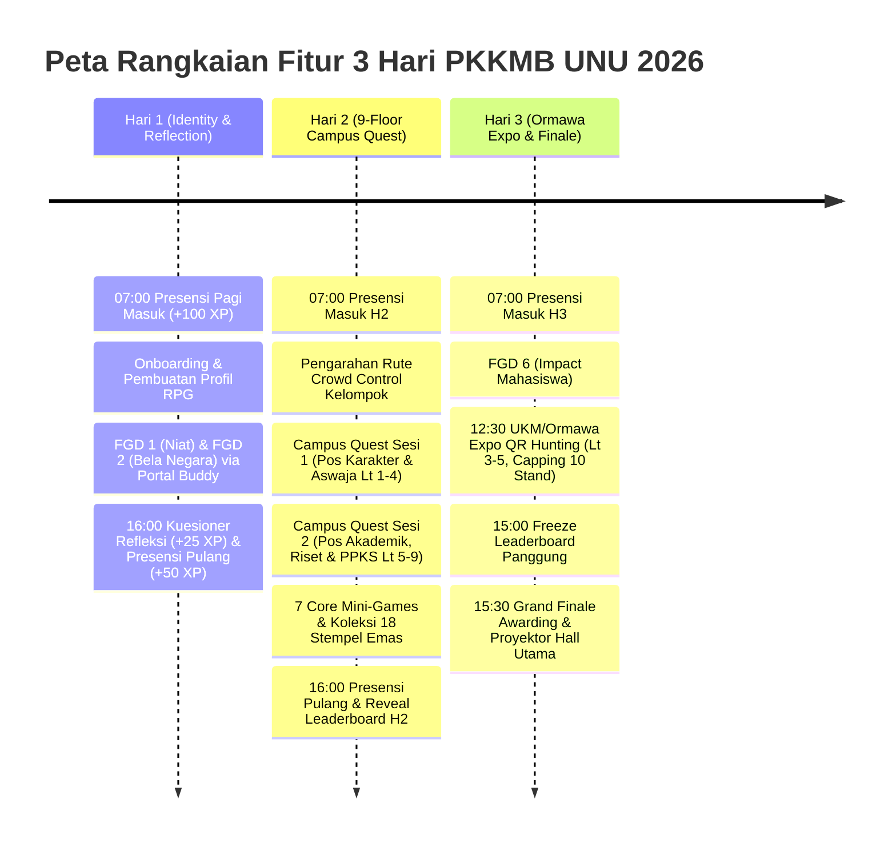

# Product Requirements Document (PRD)
## GENIUS UNU Yogyakarta 2026 — Interactive Campus Quest & Gamification Platform

* **Document Version:** 1.0.0
* **Product Name:** GENIUS UNU 2026 (Gamified Exploration & Navigation for Induction of UNU Students)
* **Event:** PKKMB UNU Yogyakarta 2026 ("Upgraded You")
* **Event Dates:** 22 - 24 September 2026
* **Target Audience:** 1,000+ Mahasiswa Baru, 50 Buddy (Game Master), 100+ Panitia/PJ Pos, Jajaran Rektorat UNU Yogyakarta
* **Owner:** Divisi IT & Digital Gamification PKKMB UNU Yogyakarta 2026

---

## 1. Executive Summary & Product Vision

### 1.1 Background & Context
Pengenalan Kehidupan Kampus bagi Mahasiswa Baru (PKKMB) Universitas Nahdlatul Ulama (UNU) Yogyakarta tahun 2026 mengusung tema **"Upgraded You"** dengan lokasi terpusat di Kampus Terpadu UNU Yogyakarta gedung 9 lantai. 

Tantangan utama orientasi kampus konvensional adalah:
1. Sifat penyampaian materi satu arah yang pasif dan membosankan.
2. Kurangnya pemahaman fisik terhadap fasilitas 9 lantai gedung kampus.
3. Keterbatasan pemantauan keaktifan mahasiswa dalam skala ribuan orang.
4. Beban kuota internet publik yang memberatkan dan risiko jaringan seluler tumbang di dalam gedung.

### 1.2 Product Vision
Membangun platform gamifikasi terpadu (*hybrid physical-digital RPG*) yang mengubah orientasi kampus menjadi petualangan interaktif 9 lantai. Mahasiswa baru mengeksplorasi fasilitas kampus secara fisik, menyelesaikan kuis etika dan pilar Aswaja di tiap pos, mengoleksi stempel digital, serta bertransformasi dari karakter awal (*New You*) menuju karakter paripurna (*Upgraded You*) melalui jaringan lokal (*Campus Intranet LAN*) yang cepat, aman, dan bebas kuota.

### 1.3 Key Value Propositions
* **Zero Quota & Sub-5ms Latency:** Beroperasi 100% pada jaringan intranet kampus tanpa membebani kuota internet mahasiswa atau internet ISP kampus.
* **Physical Geofencing & Anti-Cheat:** Mahasiswa wajib hadir fisik di tiap pos lantai 1 sampai lantai 9 untuk memindai QR fisik dan menyelesaikan tantangan.
* **Autonomous 3-Day Event Flow:** Sistem bertransformasi dinamis mengikuti 3 hari tema PKKMB:
  * **Hari 1:** Identity, Character, & FGD Intention.
  * **Hari 2:** 9-Floor Campus Quest & 7 Core Interactive Mini-Games.
  * **Hari 3:** Ormawa/UKM Discovery Expo, Puncak Inaugurasi, & Grand Finale Leaderboard.
* **Empowered Buddy Leadership:** 50 Buddy resmi memegang kendali kelompok (Genius 01 sampai Genius 50) dengan otoritas evaluasi FGD dan pemberian bonus poin apresiasi.

---

## 2. Target Personas & User Roles

### 2.1 Persona 1: Mahasiswa Baru (MABA / Adventurer)
* **Demografi:** Usia 18-20 tahun, pemilik smartphone Android/iOS, latar belakang jurusan beragam di 5 Fakultas UNU Jogja.
* **Kebutuhan:**
  * Akses mudah tanpa perlu instalasi aplikasi native (*Zero-Install Web App / PWA*).
  * Mengetahui rute kelompok agar tidak tersesat di gedung 9 lantai.
  * Antarmuka visual retro RPG yang menyenangkan dengan feedback suara instan.
  * Transparansi skor XP dan paspor stempel yang diraih secara personal.

### 2.2 Persona 2: Buddy (Game Master / Senior Mentor)
* **Demografi:** 50 Mahasiswa Senior terpilih yang membina kelompok Genius 01 sampai Genius 50.
* **Kebutuhan:**
  * Portal khusus di tablet/smartphone untuk memantau absensi anggota tim binaan.
  * Formulir rubrik penilaian cepat untuk sesi Focus Group Discussion (FGD 1, 2, dan 6).
  * Kuota bonus apresiasi (maksimal 100 poin) untuk menghadiahi inisiatif dan kekompakan tim.
  * Panduan rute kelompok untuk mengarahkan alur mobilisasi lantai.

### 2.3 Persona 3: Panitia & PJ Pos (Checkpoint Warden)
* **Demografi:** Pengurus pos materi di 9 lantai (Anti-Korupsi, Bela Negara, PPKS, Aswaja, Lab Komputer, Inkubator Bisnis).
* **Kebutuhan:**
  * Menampilkan QR Code fisik pos yang siap dipindai peserta.
  * Memastikan antrean pos berjalan tertib dan timer game pos tidak macet.

### 2.4 Persona 4: Super Admin & Pimpinan (Command Center)
* **Demografi:** Divisi IT, Ketua Panitia PKKMB, dan Rektorat UNU Yogyakarta.
* **Kebutuhan:**
  * Live monitoring statistik presensi, kepadatan tiap lantai, dan papan peringkat.
  * Kendali darurat (*Emergency Lockdown*, Buka/Tutup pos, Freeze Leaderboard).
  * Mode layar lebar panggung (*Projector / Theater Mode*) di Hall Utama Lantai 9 untuk upacara penutupan dan awarding.

---

## 3. Product Principles & Design Language

1. **Aesthetic Direction:**
   * Tema visual mengadopsi gaya *Stardew Valley Retro RPG Pixel Art*.
   * Palet warna utama: Warm Wood Brown (`#3a2818`), Parchment Cream (`#fbf6e9`), Gold/Amber (`#f59e0b`), dan Emerald Green (`#22c55e`).
   * Tipografi: Font pixel display (*Press Start 2P*, *Silkscreen*, *Pixelify Sans*) dipadukan dengan font teknikal monospace (*JetBrains Mono*) dan antarmuka modern sans-serif (*Plus Jakarta Sans*).
   * Kebijakan Bebas Emoji: Seluruh representasi grafis menggunakan icon SVG, sprite piksel, atau karakter badge orisinil.
2. **Resilience & Offline-First State:**
   * Aplikasi user dan admin wajib berfungsi penuh secara mandiri dengan cache lokal (`localStorage`) dan sinkronisasi reaktif ke backend.
   * Toleran terhadap lonjakan koneksi 1.000+ pengguna simultan saat jam presensi dan pergantian lantai.

---

## 4. The 3-Day Event Roadmap & Functional Scope



### 4.1 Hari 1: Identity, Onboarding & FGD Reflection
* **FR-01 (Check-In Gate):** Scan QR gerbang pagi, pencatatan status `ON_TIME` (07:00-07:30) atau `LATE` (>07:30), injeksi +100 XP.
* **FR-02 (RPG Character Setup):** Pemilihan nama karakter, NIM resmi, jurusan, fakultas, serta pemilihan avatar pria/wanita.
* **FR-03 (FGD Scoring Module):** Evaluasi FGD 1 dan 2 oleh Buddy dengan rubrik 3 pilar (Keaktifan, Visi, Adab).
* **FR-04 (Check-Out Gate & Kuesioner):** Pengisian kuesioner evaluasi harian (rating fasilitas, materi, buddy) disusul scan QR pulang (+50 XP).

### 4.2 Hari 2: 9-Floor Campus Quest & Game Engines
* **FR-05 (Crowd Control Rute Kelompok):** Penugasan 50 tim ke 4 varian rute rotasi lantai untuk mencegah penumpukan massa di lift dan tangga.
* **FR-06 (Interactive Building Map):** Peta 9 lantai interaktif dengan indikator status pos (*Tersedia, Terisi, Terkunci*).
* **FR-07 (7 Core Mini-Game Engines):**
  1. *Teka-Teki Silang (TTS):* Grid matriks kata bertema Aswaja dan kebangsaan.
  2. *Tebak Kata (Scramble):* Ubin huruf acak menyusun istilah kunci nilai Aswaja.
  3. *Kuis Cepat (Rapid Timer):* Kuis pilihan ganda dengan hitung mundur 15 detik.
  4. *Benar / Salah:* Penilaian etika kode etik mahasiswa dan materi Satgas PPKS.
  5. *Memory Match:* Pencocokan pasangan kartu logo fakultas dan fasilitas kampus.
  6. *Tebak Posisi Kampus:* Identifikasi lokasi ruangan melalui foto arsitektur gedung.
  7. *Master Challenge:* Ujian integrasi puncak di Lantai 9.
* **FR-08 (Digital Passport & Stempel Emas):** Minimal ambang kelulusan skor 70% untuk mengklaim stempel emas pos dan XP.

### 4.3 Hari 3: Ormawa Discovery Expo & Grand Finale
* **FR-09 (FGD 6 Impact):** Evaluasi akhir komitmen kontribusi mahasiswa baru.
* **FR-10 (Ormawa Expo QR Hunting):** Eksplorasi 20+ stand UKM/Ormawa di selasar Lantai 3-5. Scan QR stand menghasilkan lencana pengenal UKM dan bonus +75 XP per stand (dibatasi maksimal 10 stand / +750 XP).
* **FR-11 (Freeze Leaderboard):** Pembekuan papan peringkat pada pukul 15:00 untuk menjaga kejutan juara.
* **FR-12 (Projector / Theater Mode):** Layar presentasi proyektor panggung Hall Utama menampilkan animasi selebrasi Top 10 Individu, Top 5 Tim Terbaik, dan sertifikat penobatan "Upgraded You".

---

## 5. Gamification Mechanics & Economy

### 5.1 Struktur Level RPG ("Upgraded You")
Tingkat evolusi karakter dihitung berdasarkan jumlah lantai gedung kampus yang telah dituntaskan seluruh misinya:

| Nama Level | Syarat Lantai | Deskripsi Status |
| :--- | :--- | :--- |
| **New You** | 0 - 1 Lantai Tuntas | Langkah awal mahasiswa baru memasuki gerbang kampus |
| **Explorer** | 2 - 3 Lantai Tuntas | Penjelajah aktif yang mulai mengenali ekosistem kampus |
| **Achiever** | 4 - 5 Lantai Tuntas | Mahasiswa tangguh yang menguasai nilai akademik dan riset |
| **Almost There** | 6 - 8 Lantai Tuntas | Menuju fase kepemimpinan dan wawasan global |
| **Upgraded You** | 9 Lantai Tuntas | Mahasiswa paripurna berkarakter Aswaja dan berdaya saing tinggi |

### 5.2 Skema Sumber Perolehan XP (Experience Points)

| Aktivitas | Reward XP | Frekuensi Maksimal | Catatan |
| :--- | :--- | :--- | :--- |
| Presensi Masuk Pagi | +100 XP / hari | 3x (1 per hari) | Status ON_TIME (07:00-07:30) |
| Presensi Pulang & Kuesioner | +75 XP / hari | 2x (Hari 1 & 2) | Wajib menyelesaikan esai refleksi |
| Penilaian FGD 1, 2, 6 oleh Buddy | +100 s/d +200 XP / sesi | 3x sesi | Berdasarkan rubrik evaluasi Buddy |
| Penyelesaian Pos Campus Quest (Lt 1-9) | +250 s/d +500 XP / pos | 18 pos | Skor game minimal 70% |
| Bonus Apresiasi Buddy | +10 s/d +50 XP | Kuota 100 XP / tim | Dialokasikan oleh Buddy pendamping |
| Kunjungan Stand UKM/Ormawa Expo | +75 XP / stand | Maksimal 10 stand | Capping kuota 750 XP |

---

## 6. Functional Module Catalog

```
GENIUS UNU 2026 PLATFORM
├── Module A: Student Experience App (frontend/user)
│   ├── A1: Digital Check-in & RPG Profile Setup
│   ├── A2: 9-Floor Interactive Building Map
│   ├── A3: Camera QR Scanner Engine (HTML5 MediaDevices)
│   ├── A4: 7 Decoupled Mini-Game Launchers
│   ├── A5: Digital Passport & Golden Stamps Gallery
│   ├── A6: Ormawa Expo QR Hunting & Badges
│   └── A7: Personal RPG Status & Live Leaderboard
│
├── Module B: Buddy Field Portal (frontend/admin -> /buddy)
│   ├── B1: Team Roster & Real-time Attendance Tracker
│   ├── B2: 3-Pillar Rubric Scoring for FGD 1, 2, 6
│   ├── B3: Bonus Budget Dispenser (100 PTS Capacity)
│   └── B4: Assigned Route & Checkpoint Navigator
│
├── Module C: Command Center & Admin Backoffice (frontend/admin)
│   ├── C1: Real-time Telemetry Dashboard (9 Floors Activity)
│   ├── C2: 50 Official Teams & Buddy Plottings (Genius 01 - 50)
│   ├── C3: Dynamic Stage & Checkpoint Builder
│   ├── C4: Comprehensive Question Bank Manager
│   ├── C5: QR Print Center (A4 Ready Templates)
│   ├── C6: Leaderboard Freeze & Adjustments
│   └── C7: Stage Projector Theater Mode
│
└── Module D: Core Backend Services (backend & packages/shared)
    ├── D1: REST API Gateway & Authentication
    ├── D2: Anti-Cheat Stamp & XP Validation Engine
    ├── D3: Real-time Leaderboard Aggregator
    └── D4: Shared Contract Library (@genius-unu/shared)
```

---

## 7. Non-Functional Requirements (NFRs)

1. **Performance & Scalability:**
   * Waktu respon baca (*Read Latency*) di bawah 100ms pada jaringan LAN kampus.
   * Mampu menangani *burst traffic* 1.000 pengguna bersamaan saat presensi pagi (07:00 - 07:30).
2. **Security & Data Integrity:**
   * QR Code token dinamis berjangka waktu (*time-window expiring*) untuk mencegah duplikasi tangkapan layar.
   * Port Admin 3002 terisolasi dari subnet Wi-Fi mahasiswa melalui konfigurasi firewall router kampus.
3. **Availability & Zero Cloud Dependency:**
   * Sistem wajib dapat beroperasi penuh tanpa akses internet luar (*offline LAN intranet mode*).
   * Fallback otomatis ke data in-memory / `localStorage` jika komunikasi backend terputus sementara.
4. **Usability & Accessibility:**
   * Responsif di seluruh layar smartphone (lebar minimum 320px).
   * Konsumsi baterai rendah dengan animasi berbasis CSS Transform dan GPU-friendly rendering.

---

## 8. Success Metrics & Key Performance Indicators (KPIs)

* **Partisipasi Mahasiswa:** > 95% mahasiswa baru aktif menyelesaikan minimal 7 lantai pada Hari ke-2.
* **Tingkat Kelulusan Level:** > 80% mahasiswa baru mencapai level *Almost There* atau *Upgraded You*.
* **Stabilitas Sistem:** 99.9% uptime selama jam operasional (07:00 - 17:00 WIB) tanpa *service downtime*.
* **Kecepatan Presensi:** Rata-rata waktu presensi per mahasiswa di bawah 10 detik.
* **Kepuasan Pengguna:** Skor evaluasi kuesioner harian rata-rata > 4.2 dari skala 5.0 terhadap pengalaman orientasi berbasis gamifikasi.
