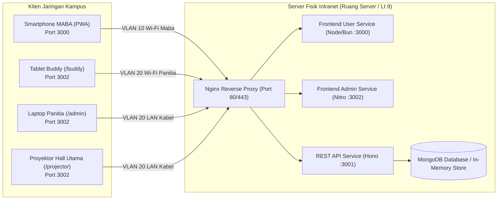
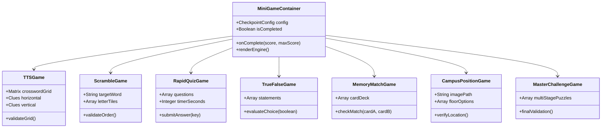

# Software Requirements Specification (SRS)
## GENIUS UNU Yogyakarta 2026 — Gamified Exploration & Navigation for Induction of UNU Students

* **Document Identifier:** SRS-GENIUS-2026-V1
* **Standard:** IEEE Std 830-1998 / ISO/IEC/IEEE 29148:2018
* **Status:** Final Baseline
* **Version:** 1.0.0
* **Date:** 2026-09-05
* **Author:** Tim Pengembang Platform Gamifikasi PKKMB UNU Yogyakarta 2026

---

## 1. Introduction

### 1.1 Purpose
Dokumen ini mendefinisikan spesifikasi persyaratan perangkat lunak (*Software Requirements Specification* - SRS) lengkap untuk sistem **GENIUS UNU 2026**. Dokumen ini menjadi acuan spesifikasi teknis dan implementasi bagi tim rekayasa perangkat lunak (*software engineers*), arsitek sistem, penguji kualitas (*QA engineers*), serta tim operasional infrastruktur jaringan kampus UNU Yogyakarta.

### 1.2 Document Conventions
* Notasi persyaratan fungsional menggunakan kode `FR-[Kategori]-[Nomor]`.
* Tingkat kepentingan menggunakan format RFC 2119: **SHALL** (wajib), **SHOULD** (direkomendasikan), dan **MAY** (opsional).
* Kebijakan tipografi dan antarmuka tunduk pada aturan ketat bebas emoji (*anti-emoji policy*); semua simbol visual direpresentasikan oleh grafis piksel RPG, icon SVG Phosphor/Lucide, atau token CSS.

### 1.3 Intended Audience & Reading Suggestions
* **Frontend Developers:** Fokus pada Seksi 2.2, Seksi 3 (FR-01 s/d FR-08), dan Seksi 4.1.
* **Backend & Database Engineers:** Fokus pada Seksi 3, Seksi 5, dan Seksi 6 (Data Models & API Contracts).
* **Network & DevOps Engineers:** Fokus pada Seksi 4.4, Seksi 5.3, dan Seksi 7 (Campus Intranet Topology).
* **Koordinator Acara & Tim Penjamin Mutu:** Fokus pada Seksi 1, Seksi 2, dan Seksi 3.

### 1.4 Project Scope
Sistem GENIUS UNU 2026 mencakup:
1. Aplikasi web mobile peserta MABA (`frontend/user`) yang berjalan pada peramban smartphone (*Zero-Install PWA*).
2. Panel kendali admin, backoffice panitia, dan portal bimbingan 50 Buddy (`frontend/admin`).
3. Layanan REST API backend (`backend`) dengan arsitektur micro-service berbasis Hono/Bun.
4. Paket kontrak TypeScript bersama (`packages/shared`).
5. Mekanisme integrasi jaringan lokal kampus (*Campus Intranet LAN*) dengan proteksi subnet panitia.

---

## 2. Overall Description

### 2.1 System Perspective & Monorepo Architecture
Sistem dibangun di atas repositori tunggal (*monorepo*) dengan Bun Workspaces:

```
genius-unu/
├── frontend/
│   ├── user/         # @genius-unu/user (Vue 3 + Vite 6 + Tailwind CSS v4, Port 3000)
│   └── admin/        # @genius-unu/admin (Nuxt 3 / Vue 3 + Tailwind CSS, Port 3002)
├── backend/          # @genius-unu/backend (Hono Framework + Bun Runtime, Port 3001)
├── packages/
│   └── shared/       # @genius-unu/shared (Domain Interfaces, Enums, DTOs)
└── docs/             # Dokumentasi Arsitektur & Pedoman Operasional
```



### 2.2 User Classes and Characteristics

| Kelas Pengguna | Frekuensi Akses | Hak Akses (*Privileges*) | Perangkat Utama |
| :--- | :--- | :--- | :--- |
| **Mahasiswa Baru (MABA)** | Sangat Tinggi (07:00 - 17:00) | Scan presensi, navigasi peta lantai, pengerjaan mini-game pos, scan stand UKM, submit kuesioner refleksi. | Smartphone Android/iOS (Web browser) |
| **Buddy (Game Master)** | Tinggi (Berkala per sesi) | Memantau absensi anggota kelompok, input nilai FGD 1, 2, 6, alokasi bonus poin apresiasi tim (maks 100 PTS). | Smartphone / Tablet |
| **PJ Pos / Lantai** | Sedang | Memantau lalu lintas antrean pos, verifikasi kelayakan stempel, bantuan teknis pos. | Smartphone / Laptop |
| **Super Admin / IT** | Kontinu | Konfigurasi pos, CRUD bank soal, cetak kartu QR A4, aktivasi stage, freeze leaderboard, mode proyektor panggung. | Laptop / PC Command Center |

### 2.3 Operating Environment
* **Hardware Server:** Minimum PC Desktop x86_64 / Apple Silicon, 4 Cores CPU, 8 GB RAM, port Gigabit Ethernet LAN.
* **Operating System Server:** Linux (Ubuntu 22.04 LTS / Debian 12 / Arch Linux).
* **Runtime & Package Manager:** Bun >= 1.2.0 dan Node.js LTS >= 20.0.0.
* **Peramban Klien (Client Browsers):** Google Chrome Mobile >= 110, Safari iOS >= 15, Mozilla Firefox >= 115, Samsung Internet. Wajib mendukung WebRTC / MediaDevices API (akses kamera) dan LocalStorage API.
* **Jaringan:** Wi-Fi IEEE 802.11ac/ax kampus terpadu UNU Yogyakarta dengan pemisahan SSID/VLAN.

### 2.4 Design & Implementation Constraints
1. **Zero External Internet Dependency:** Seluruh aset statis (gambar karakter, ikon SVG, font woff2, stylesheet, audio sound effect) wajib dibundel secara lokal. Tidak boleh ada pemanggilan CDN eksternal (seperti Google Fonts, cdnjs, unpkg, atau broken Unsplash links).
2. **Anti-Emoji Mandate:** Banned dari penggunaan simbol emoji Unicode. Semua penanda visual diwajibkan menggunakan SVG icon atau sprite pixel art.
3. **Localhost & LAN Routing Guard:** Endpoint API harus dapat disetel melalui konfigurasi lingkungan (`process.env.NUXT_PUBLIC_API_BASE` / `import.meta.env.VITE_API_BASE`).

---

## 3. System Features & Functional Requirements

### 3.1 FR-01: Identity, Character Class & Authentication Engine

* **Deskripsi:** Mengelola identitas pengguna, autentikasi peserta dan petugas, serta inisialisasi karakter RPG.
* **Input:** NIM resmi, Nama Lengkap, Program Studi, Fakultas, Password awal (`genius2026`), dan Pilihan Avatar.
* **Processing:**
  1. Sistem memverifikasi apakah NIM sudah terdaftar pada database peserta.
  2. Jika pertama kali masuk, pengguna diarahkan untuk melengkapi profil karakter RPG.
  3. Mengalokasikan pengguna ke dalam salah satu dari 50 kelompok resmi (**Genius 01 sampai Genius 50**).
  4. Menerbitkan token JWT terenkripsi dengan masa aktif 24 jam.
* **Output:** Objek pengguna aktif, status otentikasi, dan token sesi yang tersimpan di penyimpanan aman klien.
* **Error Handling:** Jika NIM tidak valid atau telah dipakai pada perangkat lain dengan status terkunci, sistem menolak autentikasi dan menampilkan pesan galat terpadu.

### 3.2 FR-02: Dynamic Geofenced QR Presensi Engine

* **Deskripsi:** Memproses kehadiran harian peserta pada gerbang masuk dan sesi kepulangan Hari 1, 2, dan 3.
* **Aturan Bisnis Presensi:**
  * **Window Waktu Masuk:**
    * `07:00 - 07:30 WIB`: Status kehadiran `ON_TIME`, reward **+100 XP**.
    * `> 07:30 WIB`: Status kehadiran `LATE`, reward **+50 XP**.
  * **Sesi Pulang (Check-Out):**
    * Pukul `16:00 - 17:00 WIB`.
    * Mahasiswa **wajib** mengisi formulir refleksi 3 bintang (Fasilitas, Materi, Buddy) dan 1 isian esai singkat.
    * Setelah kuesioner tuntas, tombol pemindai QR Pulang aktif. Reward **+75 XP**.
* **Anti-Fraud Mechanism:** Token QR di-generate menggunakan parameter waktu (*dynamic rotating token*) untuk mencegah tangkapan layar dibagikan keluar gedung. Indeks database memberlakukan *unique constraint* `(nim, day, type)`.

### 3.3 FR-03: Focus Group Discussion (FGD) & Buddy Scoring Service

* **Deskripsi:** Antarmuka khusus pada `/buddy` yang mengizinkan 50 Buddy memberikan skor keaktifan pada 3 sesi FGD:
  * **FGD 1 (Hari 1 - 08:30 WIB):** Topik Niat & Orientasi Kampus.
  * **FGD 2 (Hari 1 - 10:00 WIB):** Topik Bela Negara & Agent of Change.
  * **FGD 6 (Hari 3 - 11:00 WIB):** Topik Inovasi SDGs & Kontribusi Mahasiswa.
* **Rubrik Penilaian 3 Pilar:**
  1. *Keaktifan Berpendapat:* Skala 1 - 5.
  2. *Kedalaman Visi & Substansi:* Skala 1 - 5.
  3. *Adab, Etika, dan Kerja Sama:* Skala 1 - 5.
* **Perhitungan Skor:**
  $$\text{XP Tambahan} = (\text{Pilar 1} + \text{Pilar 2} + \text{Pilar 3}) \times 13.33 \implies \text{Rentang: } +40 \text{ s/d } +200 \text{ XP}$$
* **Bonus Budget Dispenser:** Setiap Buddy dibekali kuota apresiasi **100 PTS** per kelompok yang dapat dibagikan secara bertahap kepada anggota yang menunjukkan inisiatif tinggi.

### 3.4 FR-04: 9-Floor Interactive Building Map & Checkpoint Router

* **Deskripsi:** Visualisasi interaktif lantai 1 sampai 9 gedung UNU Yogyakarta pada antarmuka mobile peserta.
* **Fungsi:**
  * Menampilkan informasi pos yang berada di lantai aktif (misal: Lantai 1 - Pos Galeri Aswaja, Lantai 2 - Perpustakaan & Pos Integritas, Lantai 3 - Lab Komputer Cyber).
  * Menampilkan status pos: `AVAILABLE` (bisa didatangi), `OCCUPIED` (pos sedang penuh/antre), atau `COMPLETED` (pos sudah selesai dan stempel sudah diraih).
  * Panduan Crowd Control Rute: Menampilkan rute awal spesifik kelompok (misal: Genius 03 mulai dari Lantai 3) guna mendistribusikan kepadatan mahasiswa di tangga dan lift.

### 3.5 FR-05: Decoupled 7 Mini-Game Execution Engines

Sistem menyediakan container permainan mandiri (*MiniGameContainer.vue*) yang menerima props konfigurasi pos dan memicu modul permainan terkait:



* **Standar Kelulusan Permainan:** Nilai minimum kelulusan adalah **70%**.
* **Pemberian Reward:** Skor di atas 70% memicu penerbitan Stempel Emas, suara audio kemenangan, dan injeksi +250 s/d +500 XP. Peserta yang gagal diberikan kesempatan mengulang (*retry*) setelah batas waktu jeda tertentu.

### 3.6 FR-06: Passport & Golden Stamp Minting Engine

* **Deskripsi:** Galeri paspor digital mahasiswa baru yang merekam pencapaian 18 stempel resmi 9 lantai.
* **Spesifikasi Stempel:**
  * Stempel menyimpan metadata: `posId`, `floorNumber`, `gameType`, `scoreAchieved`, `timestampMinted`, dan `verifierRole`.
  * Visualisasi stempel menggunakan bingkai emas pixel art dengan efek cap stempel dan teks tanggal penyelesaian.

### 3.7 FR-07: Ormawa & UKM Discovery Expo Engine (Hari 3)

* **Deskripsi:** Modul khusus Hari ke-3 (12:30 - 14:00 WIB) untuk mendukung pameran stan Unit Kegiatan Mahasiswa di selasar Lantai 3, 4, dan 5.
* **Fungsi:**
  * Menampilkan katalog 20+ UKM dan Organisasi Mahasiswa.
  * Fitur scan QR stan UKM. Setiap pemindaian stan valid menghasilkan **+75 XP** dan **Lencana Pengenal UKM**.
  * **Quota Capping:** Batas perolehan bonus dibatasi maksimal **10 stan (+750 XP)** untuk menjaga keseimbangan kompetisi peringkat.

### 3.8 FR-08: Real-time Leaderboard & Stage Freeze Service

* **Deskripsi:** Pengurutan dan penayangan peringkat secara langsung berdasarkan total akumulasi XP.
* **Kategori Papan Peringkat:**
  1. *Leaderboard Individu:* Peringkat 1.000+ mahasiswa baru.
  2. *Leaderboard Tim:* Peringkat 50 kelompok (Genius 01 - Genius 50).
  3. *Leaderboard Fakultas:* Agregasi skor per fakultas.
* **Stage Freeze Function:** Super Admin memiliki kontrol tombol *Freeze Leaderboard*. Ketika aktif, skor publik di aplikasi peserta terkunci pada data pukul 15:00 WIB untuk menjaga kerahasiaan pengumuman juara pada upacara penutupan.

### 3.9 FR-09: Stage Projector / Theater Mode Display

* **Deskripsi:** Halaman khusus panggung pada `/projector` yang dirancang untuk layar LED videotron Hall Utama Lantai 9.
* **Fitur:**
  * Mode layar penuh (*Fullscreen Theater Mode*).
  * Tipografi berukuran besar dengan kontras tinggi terbaca dari jarak 30 meter.
  * Animasi penobatan pemenang: Top 10 Mahasiswa Terbaik dan Top 5 Kelompok Juara Umum.
  * Telemetri grafis sebaran kelulusan 9 lantai gedung.

### 3.10 FR-10: A4 Print QR Center & Token Generator

* **Deskripsi:** Generator kartu cetak fisik pada panel admin `/qr-center`.
* **Kemampuan Ekspor:**
  * 18 Kartu Pos Lantai 1-9 dengan bingkai stempel pixel RPG.
  * Kartu Gerbang Presensi Masuk & Pulang Hari 1, 2, 3.
  * 20+ Kartu Stand Pameran Ormawa/UKM Expo.
  * Format cetak presisi dokumen A4 (*CSS @media print*) siap pakai tanpa konfigurasi tambahan.

---

## 4. External Interface Requirements

### 4.1 User Interfaces
* **Frontend User:** Antarmuka responsif ramah jempol (*thumb-friendly mobile view*) dengan container maksimum `max-w-md mx-auto`. Menggunakan efek tactile active `-translate-y-[1px]` untuk simulasi tombol mekanis RPG.
* **Frontend Admin:** Dashboard analitis dengan navigasi sidebar adaptif (*expanded 264px, collapsed 74px*), toolbar sticky berpiksel, dan paginasi data fleksibel (default 50 baris per halaman untuk menampilkan seluruh 50 kelompok sekaligus).

### 4.2 Hardware Interfaces
* **Kamera Smartphone:** Diakses melalui W3C `navigator.mediaDevices.getUserMedia({ video: { facingMode: 'environment' } })` untuk pemindaian QR Code secara langsung di browser.
* **Display Videotron / Proyektor:** Output resolusi 1920x1080 (Full HD) dan 3840x2160 (4K) via port HDMI pada laptop panitia panggung.

### 4.3 Software Interfaces
* **Runtime:** Bun 1.2+ engine untuk eksekusi server backend dengan performa tinggi.
* **Web Engine:** Nuxt 3 (Nitro server preset node-server) untuk admin dan Vite 6 untuk user PWA.
* **Audio Engine:** Web Audio API (`AudioContext`) sintesis osilator nada retro 8-bit untuk efek suara tanpa dependensi file audio eksternal yang berat.

### 4.4 Communications Interfaces
* **Protokol:** HTTP/1.1 dan HTTPS melalui TCP/IP.
* **Data Interchange Format:** JSON (`application/json; charset=utf-8`).
* **Jaringan:** Intranet Lokal Kampus UNU Yogyakarta.

---

## 5. Non-Functional Requirements (NFRs)

### 5.1 Performance Requirements
* **Response Latency:** Rata-rata waktu tanggap API pada jaringan intranet lokal kampus $\le 20\text{ ms}$ untuk operasi baca dan $\le 50\text{ ms}$ untuk operasi tulis skor.
* **Throughput:** Sistem wajib mampu melayani minimal **350 request per detik (RPS)** tanpa *packet loss*.
* **Bundle Size:** Ukuran bundel JavaScript terkompresi $\le 650\text{ kB}$ untuk menjamin rendering awal di smartphone peserta dalam waktu kurang dari 1.5 detik.

### 5.2 Reliability & Fault Tolerance
* **In-Memory & Storage Fallback:** Jika koneksi API backend terputus, lapisan composable `useApi` dan store Pinia wajib melakukan *seamless fallback* ke repositori lokal `mockDb` / `localStorage` sehingga proses permainan di lapangan tidak terhenti.
* **Hydration Safety Guard:** Skrip inisialisasi wajib memeriksa integritas data 50 Buddy dan 50 Tim. Jika data lokal di peramban mengalami anomali atau terhapus, sistem secara otomatis meregenerasi ke-50 Buddy resmi PKKMB 2026.

### 5.3 Security & Anti-Fraud Guard
* **Role-Based Access Control (RBAC):** Pemisahan hak akses menggunakan claim token JWT:
  * `ADMIN`: Akses menyeluruh ke seluruh modul backoffice.
  * `BUDDY`: Akses terbatas pada evaluasi anggota kelompok binaan dan kuota bonus.
  * `PARTICIPANT`: Akses terbatas pada paspor dan pencatatan skor pribadi.
* **Network Isolation:** Port admin `3002` wajib diproteksi di router Mikrotik kampus melalui filter firewall sehingga hanya dapat diakses melalui VLAN panitia atau alamat IP subnet tertentu.

### 5.4 Software Quality Attributes
* **Maintainability:** Seluruh modul permainan mini-game dirancang *loosely coupled* (terpisah) dan hanya berkomunikasi via props dan emitted events standar.
* **Anti-Emoji Policy:** Larangan mutlak penggunaan karakter emoji dalam seluruh output kode, antarmuka, dan teks dokumentasi.

---

## 6. Data Models & API Specifications

### 6.1 Core Data Schema (TypeScript Domain Entities)

```typescript
// User & RPG Profile
export interface User {
  id: string;
  username: string; // NIM atau ID Panitia
  fullName: string;
  email: string;
  role: 'ADMIN' | 'BUDDY' | 'PARTICIPANT';
  status: 'ACTIVE' | 'INACTIVE';
  nim?: string;
  prodi?: string;
  faculty?: string;
  gender?: 'MALE' | 'FEMALE';
  characterClass?: 'CYBER_KNIGHT' | 'DATA_ALCHEMIST' | 'QUANTUM_MAGE' | 'SHADOW_SCOUT';
  characterTier?: number; // 1: Novice, 2: Adept, 3: Master
  characterTitle?: string;
  totalScore?: number;
  teamId?: string;
  teamName?: string;
  assignedTeamId?: string; // Khusus Buddy
  buddyRole?: 'PRIMARY' | 'ASSISTANT';
  bonusSpent?: number; // Akumulasi bonus yang diberikan Buddy (Max 100)
  avatarUrl?: string;
  createdAt: string;
}

// Team Entity
export interface Team {
  id: string;
  code: string; // e.g. "GENIUS-01"
  name: string; // e.g. "Genius 01"
  buddyId: string;
  buddyName: string;
  currentFloor: number;
  totalScore: number;
  assignedRouteId: string;
  assignedRouteName: string;
  memberCount: number;
  createdAt: string;
}

// Attendance Record
export interface Attendance {
  id: string;
  userId: string;
  day: 1 | 2 | 3;
  type: 'CHECK_IN' | 'CHECK_OUT';
  status: 'ON_TIME' | 'LATE';
  timestamp: string;
  verifiedBy?: string;
  reflection?: {
    facilityRating: number;
    materialRating: number;
    buddyRating: number;
    essayNote: string;
  };
  xpAwarded: number;
}

// Checkpoint (Pos Lantai)
export interface Checkpoint {
  id: string;
  floorNumber: number; // 1 - 9
  code: string; // e.g. "L1-POS-01"
  name: string;
  roomNumber: string;
  gameType: 'TTS' | 'SCRAMBLE' | 'QUIZ' | 'TRUE_FALSE' | 'MEMORY' | 'POSITION' | 'MASTER';
  pilarCategory: string;
  qrCode: string;
  passThresholdScore: number; // Default 70
  rewardXp: number;
  status: 'AVAILABLE' | 'OCCUPIED' | 'LOCKED';
}
```

### 6.2 RESTful API Contracts Endpoint Summary

| Metode | Endpoint | Deskripsi | Otorisasi |
| :--- | :--- | :--- | :--- |
| `POST` | `/api/auth/login` | Autentikasi pengguna & penerbitan token | Publik |
| `GET` | `/api/users` | Pengambilan daftar pengguna (Filter: role, team, search) | Admin / Buddy |
| `GET` | `/api/users/:id` | Detail profil pengguna & riwayat transaksi skor | Pengguna / Admin |
| `POST` | `/api/attendance/check-in` | Validasi scan QR masuk & pencatatan XP | Peserta |
| `POST` | `/api/attendance/check-out` | Validasi refleksi & scan QR kepulangan | Peserta |
| `POST` | `/api/buddies/evaluate-fgd` | Input penilaian rubrik 3 pilar FGD 1, 2, 6 | Buddy |
| `POST` | `/api/buddies/grant-bonus` | Pemberian bonus poin apresiasi tim | Buddy |
| `GET` | `/api/floors` | Daftar 9 lantai dan status pos terkini | Peserta / Admin |
| `POST` | `/api/quest/verify-stamp` | Validasi penyelesaian mini-game & minting stempel | Peserta |
| `POST` | `/api/ormawa/scan` | Validasi kunjungan stand UKM Expo Hari 3 | Peserta |
| `GET` | `/api/leaderboard` | Rekapitulasi peringkat individu, tim, dan fakultas | Publik Intranet |
| `POST` | `/api/admin/leaderboard/freeze`| Toggle pembekuan papan peringkat | Super Admin |

---

## 7. Campus Localhost Deployment Topology

Konfigurasi topologi penempatan sistem di Kampus Terpadu UNU Yogyakarta:

```
[ KAMPUS TERPADU UNU YOGYAKARTA - GEDUNG 9 LANTAI ]
                     │
                     ▼
          [ Router Core Mikrotik Kampus ]
          │  - Static DNS: pkkmb.unu.local -> 192.168.10.50
          │  - DHCP Server & Subnet Allocation
          │
          ├── [ VLAN 10: Wi-Fi Peserta Maba (192.168.100.0/22) ]
          │   ├── Access Point Lt 1 - Lt 9
          │   └── Smartphone Maba -> Akses http://pkkmb.unu.local:3000
          │       (Firewall: Blokir akses ke Port 3002)
          │
          ├── [ VLAN 20: Jaringan Panitia & Server (192.168.10.0/24) ]
          │   ├── Kabel LAN Command Center Lt 9
          │   ├── Tablet 50 Buddy GM
          │   └── Laptop Proyektor Panggung -> Akses http://pkkmb.unu.local:3002
          │
          └── [ Host Server Lokal - Ruang Server / Lt 9 (IP: 192.168.10.50) ]
              ├── Nginx Reverse Proxy (Port 80/443)
              ├── PM2 Service: @genius-unu/user (Port 3000)
              ├── PM2 Service: @genius-unu/backend (Port 3001)
              └── PM2 Service: @genius-unu/admin (Port 3002)
```

### Prosedur Operasional Eksekusi Produksi di Server Lokal:
```bash
# 1. Instalasi dependensi monorepo
bun install

# 2. Kompilasi build seluruh artefak produksi
bun run build

# 3. Eksekusi manajer proses PM2 di background
pm2 start "bun run dev:user" --name "genius-user-3000"
pm2 start "bun run dev:admin" --name "genius-admin-3002"
pm2 start "bun run dev:backend" --name "genius-backend-3001"

# 4. Verifikasi status operasional
pm2 status
```
